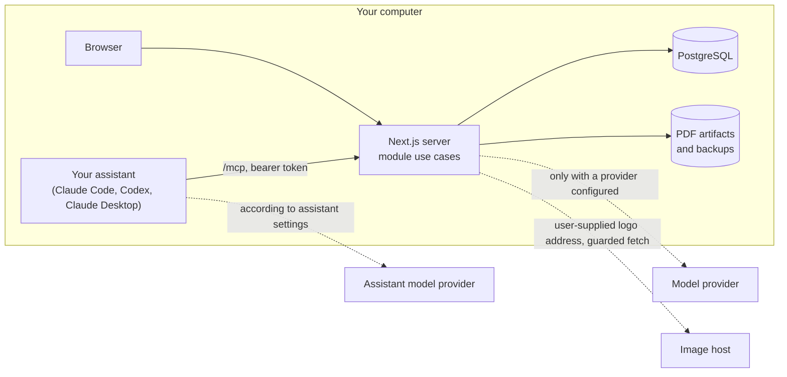

# Landed

**Get the interview.** Landed is a job-search application that runs on your own computer. It keeps your real career facts in a local database, and for each job posting you paste in it writes a tailored resume, cover letter and recruiter message from those facts. Its grounding checks flag missing evidence and unsupported numbers; drafts still need your review.

[](https://github.com/3333444n/landed/actions/workflows/ci.yml)
[](LICENSE)

## Why it exists

Tailoring an application by hand takes an hour per job, and the shortcuts are bad: a generic resume, or an AI chat that happily invents metrics you then have to catch. Landed sits in between. You enter your work history, projects, skills and achievements once, with the numbers you can actually defend. Generated content carries evidence references, grounding violations get warning chips, and you can edit the text before downloading a one-page PDF. Storage stays local. A configured provider or your chosen assistant receives the facts needed for the task; the assistant has its own data handling. Pasting a logo address also makes a guarded image request.

## What it does today

| Area | What you get |
|---|---|
| Career facts | Profile, work history, education, projects, skills and achievements, edited in the browser and stored in PostgreSQL on your computer |
| Jobs | Paste a posting with its salary and the company's logo (an image file or an image address); each one gets an application with a status you set by hand (preparing, ready, applied, interviewing, offer, rejected, withdrawn, accepted), notes, filters and sorting. A word cloud shows which words the posting repeats and which of them are already among your skills |
| Documents | Per job, a generated resume, cover letter and recruiter message. Each bullet cites your records; numbers that do not appear in the cited evidence are flagged. Edit summaries, bullets and body text in place; every edit is a saved revision |
| PDFs | One-page resume filled to the margin and a one-page cover letter, monochrome, built from saved document revisions; review remains a manual step |
| Model access | Bring an API key for OpenRouter, Anthropic, OpenAI, the Vercel AI Gateway or any OpenAI-compatible server (Ollama and similar), or use no key at all: paste-back mode shows you the prompt, you run it in whatever assistant you already have and paste the answer back through the same checks |
| Your assistant | Connection instructions for Claude Code, Codex and Claude Desktop, without a Landed model key: your assistant writes the documents and Landed checks them |
| Runs | Every model call is recorded with model, prompt version, tokens, latency and cost, visible next to the document |
| Data safety | Backup and restore of the database, the PDFs and the logos; keys live only in your environment file; provider requests, connected assistants, paste-back and logo-address fetches have the data boundaries described in [SECURITY](SECURITY.md) |

Status: **Phase 1b complete (2026-09-14); assistant surface complete (2026-09-16)**. The table describes implemented features; client-specific verification is listed in the decision register. In particular, the packaged Docker install is tested on macOS, and the assistant connection has been used end to end from Claude Code on a contributor install (the packaged install's generated token is not yet exercised in Docker); Windows and Linux are untested. What is not built yet: importing a posting from a link, scoring how well you match, company research, automatic discovery of jobs, and interview tracking. See [product scope and phases](docs/01-product-and-phases.md) for the roadmap and [decisions and readiness](docs/09-decisions-and-readiness.md) for the honest list of known gaps.

## Quickstart

You need Docker Desktop (macOS, Windows) or Docker Engine with Compose (Linux). No Node, no database install, no AI account.

```sh
git clone https://github.com/3333444n/landed.git
cd landed
sh scripts/landed.sh start        # Windows: powershell -ExecutionPolicy Bypass -File scripts\landed.ps1 start
```

The first start takes a few minutes, then open http://127.0.0.1:3000 and enter your name. `stop`, `status`, `logs`, `backup`, `restore` and `token` are the other launcher commands. To let Landed call a model itself, open Settings in the app: it lists the three lines to add to `.env.release` for each provider. The [quickstart](docs/07-quickstart-contract.md) has the provider table, backup, upgrade and troubleshooting.

To work on the code you need Node 22, pnpm and Docker; the [contributor path](docs/07-quickstart-contract.md#contributor-path-tested) is six commands.

## How a document gets made

1. You press Generate on a job. Landed freezes a snapshot of your facts and the posting, and writes a run record before anything is sent.
2. The model is asked for structured content (a Zod schema), with the posting kept inside a labelled data block and treated as untrusted input rather than instructions.
3. The answer is validated against the schema, then checked deterministically: every evidence id must exist in the snapshot, and every number in the text must appear in the cited records. Violations become warning chips, never silent edits.
4. The result is saved as an immutable revision. You edit in place (each save is a new revision), mark it reviewed, and download the PDF. Nothing is ever submitted for you.

Paste-back mode is the same pipeline with you as the model: the app shows the prompt, you paste the JSON answer back, and it goes through the same validation and checks. Your own assistant (below) is the same pipeline again, with the assistant asking for the prompt and submitting the answer itself through a local connection.

## Use your own assistant

Use the assistant you already pay for, no key needed ([ADR 008](docs/adr/008-assistant-surface-over-mcp.md)). The assistant reads your jobs and facts through a local MCP connection (the assistant may use a remote model provider), writes the documents, and every draft it hands back goes through the same checks as above. Three steps:

1. Start Landed as usual.
2. Open Settings → Connect your assistant in the app and copy the block for your tool (Claude Code, Codex or Claude Desktop). It contains the address and the token this installation generated.
3. Install the workflow so the assistant knows the steps. Claude Code:

   ```sh
   claude plugin marketplace add 3333444n/landed
   claude plugin install landed@landed    # asks for the address and the token from step 2
   ```

   Codex discovers the same skill by itself when you run it inside the Landed checkout; to use it from anywhere, link it into your user skills: `mkdir -p ~/.agents/skills && ln -s "$PWD/.agents/skills/landed" ~/.agents/skills/landed`. Claude Desktop uses the block from step 2 alone.

The profile-management extension is on the feature branch, locally accepted, pending merge ([ADR 009](docs/adr/009-profile-management-over-mcp.md)). It adds conversational profile creation and editing, plus individual career-record deletion through the same connection. See the [branch testing instructions](docs/07-quickstart-contract.md#trying-profile-tools-on-the-feature-branch-adr-009-pending-merge).

Then ask for a resume: "tailor my resume for the Acme job". The assistant checks the fit first, writes the resume, cover letter and recruiter message in turn, fixes the warnings Landed raises, and gives you the PDF links. It never marks an application applied and never sends anything.

## Architecture in one screen

TypeScript, Next.js (App Router, Server Actions), PostgreSQL through Drizzle with committed SQL migrations, Zod for every boundary, the Vercel AI SDK behind one adapter interface, `@modelcontextprotocol/server` for the assistant endpoint at `/mcp`, `@react-pdf/renderer` for PDFs, `lucide-react` for interface icons, Vitest and Playwright for tests, Docker Compose for the packaged install. A modular monolith: four modules (`profile`, `jobs`, `applications`, `documents`), each six files with the same roles, each owning its tables; cross-module workflows live in the app layer and never reach into another module's persistence.



Decisions that shaped it, each with its reasoning and the alternatives rejected:

- [ADR 001](docs/adr/001-local-typescript-postgresql.md): local TypeScript application on PostgreSQL, no hosted service.
- [ADR 002](docs/adr/002-achievements-and-snapshots.md): achievements edited in place; generation snapshots and document revisions are the history.
- [ADR 003](docs/adr/003-local-packaging.md): Docker Compose packaging with a one-shot migrate task and a launcher.
- [ADR 004](docs/adr/004-drizzle-persistence.md): Drizzle with generated SQL migrations reviewed like code.
- [ADR 005](docs/adr/005-url-driven-columns.md): the interface as URL-driven columns; a job's status is derived, never stored.
- [ADR 006](docs/adr/006-model-access-path.md): the app calls the provider through one adapter; keys live in the environment only; paste-back as the zero-setup path; a fake adapter for every automated check.
- [ADR 007](docs/adr/007-user-initiated-image-fetch.md): a logo address you paste is the one outbound request you start, fetched once through a guarded fetcher and stored.
- [ADR 008](docs/adr/008-assistant-surface-over-mcp.md): your own assistant drives Landed through a local MCP endpoint with a launcher-minted token; Landed keeps validation, grounding and the run record.
- [ADR 009 — Profile management over MCP](docs/adr/009-profile-management-over-mcp.md): typed profile and individual-record operations, partial updates, retry ids and required version checks; locally accepted on this branch, pending merge.

The [numbered documentation](docs/00-index.md) covers product, domain, modules, data model, workflows and failures, AI and integrations, quickstart, and the decision register. The interface follows [DESIGN.md](DESIGN.md); the produced PDFs follow [DESIGN-DOCS.md](DESIGN-DOCS.md).

## Testing and quality

CI runs on every pull request: formatting, lint, types, unit tests, integration tests against a real PostgreSQL, a production build, browser journeys, and a check that the committed migrations match the schema. All of it runs with a fake model adapter, so no credentials are ever needed; the assistant endpoint is driven in process with the MCP client and no model. Real providers are measured separately with `pnpm eval` on synthetic cases; [doc 06](docs/06-ai-and-integrations.md) lists which providers have actually been run. Commits follow Conventional Commits and pull requests state what was tested.

## Contributing

Issues and pull requests are welcome, including documentation fixes. Start with [CONTRIBUTING](CONTRIBUTING.md), which has the checks, the commit and pull-request conventions, and the rules that are easy to miss. Please report security issues as described in [SECURITY](SECURITY.md). Fictional example data lives in [examples](examples/README.md); never commit real career data.

## License

[MIT](LICENSE). Built by [Luis Peregrino](https://github.com/3333444n).
