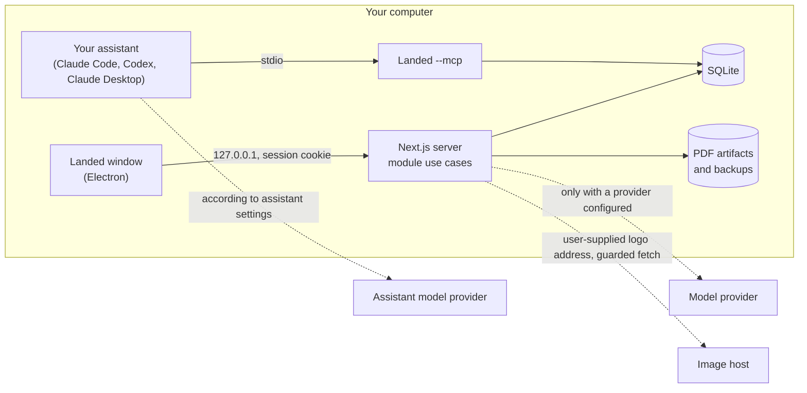

# Landed

**Get the interview.** Landed is a job-search application that runs on your own computer. It keeps your real career facts in a local database, and for each job posting you paste in it writes a tailored resume, cover letter and recruiter message from those facts. Its grounding checks flag missing evidence and unsupported numbers; drafts still need your review.

[](https://github.com/3333444n/landed/actions/workflows/ci.yml)
[](LICENSE)

## Why it exists

Tailoring an application by hand takes an hour per job, and the shortcuts are bad: a generic resume, or an AI chat that happily invents metrics you then have to catch. Landed sits in between. You enter your work history, projects, skills and achievements once, with the numbers you can actually defend. Generated content carries evidence references, grounding violations get warning chips, and you can edit the text before downloading a one-page PDF. Storage stays local. A configured provider or your chosen assistant receives the facts needed for the task; the assistant has its own data handling. Pasting a logo address also makes a guarded image request.

## What it does today

| Area | What you get |
|---|---|
| Career facts | Profile, work history, education, projects, skills and achievements, edited in the browser and stored in a SQLite file on your computer. Browse expandable cards, edit desired-role pills, link skills to roles/projects and filter Skills/Achievements by multiple contexts |
| Jobs | Paste a posting with its salary; each one gets an application with a status you set by hand (preparing, ready, applied, interviewing, offer, rejected, withdrawn, accepted), notes, filters and sorting. A word cloud shows which words the posting repeats and which of them are already among your skills |
| Companies and context | Shared company names and logos, sourced findings, application interest, profile writing context and customizable Job Sources |
| Documents | Per job, a generated resume, cover letter and recruiter message. Each bullet cites your records; numbers that do not appear in the cited evidence are flagged. Edit summaries, bullets, body text and document metadata in place; every edit is a saved revision |
| PDFs | One-page resume filled to the margin and a snapshot-backed cover letter with clickable contact links; short letters fit one page and longer letters can continue. PDFs are built from saved revisions; review remains a manual step |
| Model access | Bring an API key for OpenRouter, Anthropic, OpenAI, the Vercel AI Gateway or any OpenAI-compatible server (Ollama and similar), or use no key at all: paste-back mode shows you the prompt, you run it in whatever assistant you already have and paste the answer back through the same checks |
| Your assistant | Create and edit career facts, delete individual records, and write documents through 43 MCP tools, including Companies and writing context. Connection instructions for Claude Code, Codex and Claude Desktop, without a Landed model key: your assistant writes the documents and Landed checks them |
| Runs | Every model call is recorded with model, prompt version, tokens, latency and cost, visible next to the document |
| Data safety | The database is backed up before every upgrade migrates it; the model key lives in your operating system's keychain (or `.env` when run from source); provider requests, connected assistants, paste-back and logo-address fetches have the data boundaries described in [SECURITY](SECURITY.md) |

Status: **Phases 0 and 1, the assistant surface, Companies and writing context, document formatting and the desktop app are implemented (2026-10-02)**. The table describes implemented features; client-specific verification is listed in the decision register. The packaged app is smoke-tested on macOS; the Windows and Linux installers are first exercised by the release workflow, and the builds are not signed yet. What is not built yet: importing a posting from a link, scoring how well you match, built-in company research, automatic discovery of jobs, and interview tracking. See [product scope and phases](docs/01-product-and-phases.md) for the roadmap and [decisions and readiness](docs/09-decisions-and-readiness.md) for the honest list of known gaps.

## Install

Download the installer for your computer from [GitHub Releases](https://github.com/3333444n/landed/releases). The builds are not signed yet, so each system asks once:

- macOS (`arm64` for Apple silicon, `x64` for Intel): open the dmg and drag Landed to Applications. The first launch is blocked; open System Settings → Privacy & Security → Open Anyway, or run `xattr -dr com.apple.quarantine /Applications/Landed.app`.
- Windows: run the installer; at the SmartScreen warning choose More info → Run anyway.
- Linux: `chmod +x Landed-*.AppImage`, then run it.

Updates: Landed tells you at startup when a newer version exists. Download it and install it over the old one. Your data stays in the app's user-data folder and is backed up before the new version migrates it.

## Quickstart

To run it from source instead, you need Node 24 and pnpm. No database install, no AI account.

```sh
git clone https://github.com/3333444n/landed.git
cd landed
pnpm install
cp .env.example .env
pnpm db:migrate
pnpm dev
```

Then open http://localhost:3000 and enter your name. Your data is one SQLite file, `data/landed.db`; `pnpm db:backup` copies it to `backups/`. To let Landed call a model itself, open Settings in the app: it lists the lines to add to `.env` for each provider. The [quickstart](docs/07-quickstart-contract.md) has the provider table, backup, restore and the import from an older Docker/PostgreSQL install.

## How a document gets made

1. You press Generate on a job. Landed freezes a snapshot of your facts and the posting, and writes a run record before anything is sent.
2. The model is asked for structured content (a Zod schema), with the posting kept inside a labelled data block and treated as untrusted input rather than instructions.
3. The answer is validated against the schema, then checked deterministically: every evidence id must exist in the snapshot, and every number in the text must appear in the cited records. Violations become warning chips, never silent edits.
4. The result is saved as an immutable revision. You edit in place (each save is a new revision), mark it reviewed, and download the PDF. Nothing is ever submitted for you.

Paste-back mode is the same pipeline with you as the model: the app shows the prompt, you paste the JSON answer back, and it goes through the same validation and checks. Your own assistant (below) is the same pipeline again, with the assistant asking for the prompt and submitting the answer itself through a local connection.

## Use your own assistant

Use the assistant you already pay for, no key needed ([ADR 008](docs/adr/008-assistant-surface-over-mcp.md)). The assistant reads your jobs and facts through a local MCP connection over stdio (the assistant may use a remote model provider), writes the documents, and every draft it hands back goes through the same checks as above. Two steps:

1. Open Settings → Connect your assistant in the app and copy the block for your tool (Claude Code, Codex or Claude Desktop). It names the Landed executable with `--mcp` (from a checkout, `pnpm mcp`); the assistant starts it itself over stdio, so there is no token and nothing listens on the network, and it works while the app is closed.
2. Install the workflow so the assistant knows the steps. Claude Code:

   ```sh
   claude plugin marketplace add 3333444n/landed
   claude plugin install landed@landed    # asks for the executable path from step 1
   ```

   Codex discovers the same skill by itself when you run it inside the Landed checkout; to use it from anywhere, link it into your user skills: `mkdir -p ~/.agents/skills && ln -s "$PWD/.agents/skills/landed" ~/.agents/skills/landed`. Claude Desktop uses the block from step 1 alone.

The merged [profile-management extension](docs/adr/009-profile-management-over-mcp.md) supports conversational profile creation and editing, plus individual career-record deletion through the same connection. See the [profile setup instructions](docs/07-quickstart-contract.md#using-profile-tools-adr-009).

Then ask for a resume: "tailor my resume for the Acme job". The assistant checks the fit first, writes the resume, cover letter and recruiter message in turn, fixes the warnings Landed raises, and gives you the PDF links. It never marks an application applied and never sends anything.

## Architecture in one screen

TypeScript, Next.js (App Router, Server Actions), SQLite (`node:sqlite`) through Drizzle with committed SQL migrations, Zod for every boundary, the Vercel AI SDK behind one adapter interface, `@modelcontextprotocol/server` for the assistant tools over stdio, `@react-pdf/renderer` for PDFs, `lucide-react` for interface icons, Vitest and Playwright for tests, Electron and electron-builder for the desktop app. A modular monolith: five modules (`profile`, `companies`, `jobs`, `applications`, `documents`), each six files with the same roles, each owning its tables; cross-module workflows live in the app layer and never reach into another module's persistence.


```mermaid
flowchart LR
  subgraph local["Your computer"]
    window["Landed window\n(Electron)"] -->|"127.0.0.1, session cookie"| app["Next.js server\nmodule use cases"]
    assistant["Your assistant\n(Claude Code, Codex, Claude Desktop)"] -->|"stdio"| mcp["Landed --mcp"]
    app --> db[("SQLite")]
    mcp --> db
    app --> files[("PDF artifacts\nand backups")]
  end
  app -.->|"only with a provider configured"| provider["Model provider"]
  assistant -.->|"according to assistant settings"| assistantProvider["Assistant model provider"]
  app -.->|"user-supplied logo address, guarded fetch"| images["Image host"]
```

Decisions that shaped it, each with its reasoning and the alternatives rejected:

- [ADR 001](docs/adr/001-local-typescript-postgresql.md): local TypeScript application, no hosted service (its PostgreSQL choice revised by ADR 013).
- [ADR 002](docs/adr/002-achievements-and-snapshots.md): achievements edited in place; generation snapshots and document revisions are the history.
- [ADR 003](docs/adr/003-local-packaging.md): the former Docker Compose packaging, superseded by ADR 013.
- [ADR 004](docs/adr/004-drizzle-persistence.md): Drizzle with generated SQL migrations reviewed like code.
- [ADR 005](docs/adr/005-url-driven-columns.md): the interface as URL-driven columns; a job's status is derived, never stored.
- [ADR 006](docs/adr/006-model-access-path.md): the app calls the provider through one adapter; keys live in the environment only; paste-back as the zero-setup path; a fake adapter for every automated check.
- [ADR 007](docs/adr/007-user-initiated-image-fetch.md): a logo address you paste is the one outbound request you start, fetched once through a guarded fetcher and stored.
- [ADR 008](docs/adr/008-assistant-surface-over-mcp.md): your own assistant drives Landed over MCP; Landed keeps validation, grounding and the run record.
- [ADR 009 — Profile management over MCP](docs/adr/009-profile-management-over-mcp.md): typed profile and individual-record operations, partial updates, retry ids and required version checks.
- [ADR 013](docs/adr/013-desktop-distribution.md): the Electron desktop app on a SQLite file, with the assistant tools over stdio.

The [numbered documentation](docs/00-index.md) covers product, domain, modules, data model, workflows and failures, AI and integrations, quickstart, and the decision register. The interface follows [DESIGN.md](DESIGN.md); the produced PDFs follow [DESIGN-DOCS.md](DESIGN-DOCS.md).

## Testing and quality

CI runs on every pull request: formatting, lint, types, unit tests, integration tests against real SQLite files, a production build, browser journeys, and a check that the committed migrations match the schema. All of it runs with a fake model adapter, so no credentials are ever needed; the assistant tools are driven in process and over stdio with the MCP client and no model. Real providers are measured separately with `pnpm eval` on synthetic cases; [doc 06](docs/06-ai-and-integrations.md) lists which providers have actually been run. Commits follow Conventional Commits and pull requests state what was tested.

## Contributing

Issues and pull requests are welcome, including documentation fixes. Start with [CONTRIBUTING](CONTRIBUTING.md), which has the checks, the commit and pull-request conventions, and the rules that are easy to miss. Please report security issues as described in [SECURITY](SECURITY.md). Fictional example data lives in [examples](examples/README.md); never commit real career data.

## License

[MIT](LICENSE). Built by [Luis Peregrino](https://github.com/3333444n).


## Writing context and Companies

The career hub is Profile, with General info and a separate About me narrative; each application records Interest. Companies stores shared names, logos, location, website, About and sourced findings. Jobs select that canonical Company and up to five relevant findings; Job Sources is a customizable, initially empty list under Settings. Short cover letters use this context alongside career evidence, with distinct citations and review warnings.

The merged ADR 011 baseline exposes 42 MCP tools and the formatting extension (ADR 012) a 43rd. Its company-identity follow-up removes the duplicate free-text employer field and job-owned logos; add_job accepts optional company_id. These changes merged in PRs #43–47 on 2026-09-23.
