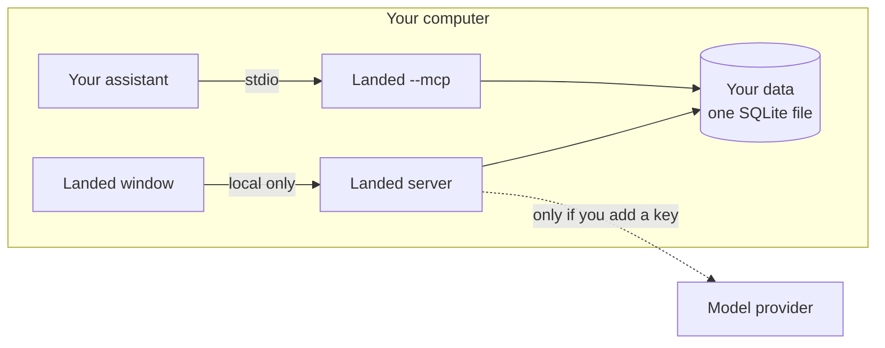

# Landed

**Get the interview.** Landed is a desktop app that keeps your real career facts on your own computer and, for each job you paste in, writes a tailored resume, cover letter and recruiter message from those facts, then checks that nothing was invented.

[](https://github.com/3333444n/landed/actions/workflows/ci.yml)
[](LICENSE)

## Why it exists

I needed a job, and tailoring every application by hand took an hour. The shortcuts were worse: a generic resume, or an AI chat that happily invents metrics you then have to catch. So I built Landed and made it open source.

You enter your work history, projects, skills and achievements once, with the numbers you can actually defend. Every generated bullet cites the records it came from, numbers that don't appear in those records are flagged, and nothing is sent anywhere for you. Drafts stay drafts until you review them.

## What it does

- **Career facts in one place.** Profile, work history, education, projects, skills and achievements, stored in one file on your computer.
- **Jobs and applications.** Paste a posting; track its status, notes and interest; see which of its words already match your skills.
- **Tailored documents.** A one-page resume, a cover letter and a recruiter message per job, edited in place, with every change saved as a revision and downloaded as PDF.
- **Grounding checks.** Evidence must exist, numbers must appear in the cited records, and violations show as warnings, never silent edits.
- **Companies and context.** Shared company profiles with sourced findings, used to write short, specific cover letters.
- **Any model, or none.** Use an API key (OpenRouter, Anthropic, OpenAI, the Vercel AI Gateway or any OpenAI-compatible server such as Ollama), paste prompts into an assistant you already have, or let your assistant drive Landed directly.

Not built yet: importing a posting from a link, match scoring, built-in company research, automatic job discovery and interview tracking. See the [roadmap](docs/01-product-and-phases.md).

## Install

Download the installer for your computer from [GitHub Releases](https://github.com/3333444n/landed/releases). The builds are not signed yet, so your system asks once:

- **macOS** (`arm64` for Apple silicon, `x64` for Intel): open the dmg and drag Landed to Applications. The first launch is blocked; open System Settings → Privacy & Security → Open Anyway.
- **Windows:** run the installer; at the SmartScreen warning choose More info → Run anyway.
- **Linux:** `chmod +x Landed-*.AppImage`, then run it.

Landed tells you in the sidebar when a new version is out. On Windows and Linux it downloads in the background; choose Restart to update. On macOS, until the builds are signed, choose Download: Landed checks the download and opens it, and you drag Landed to Applications to replace the old app, then reopen it. Your data stays where it is and is backed up before the new version upgrades it.

## Use it with your assistant

If you already pay for Claude Code, Codex or Claude Desktop, you don't need an API key. Open **Settings → Connect your assistant**, copy the block for your tool, and ask: "tailor my resume for the Acme job." The assistant reads your facts and the posting, writes the documents, and every draft goes through the same checks. It runs Landed itself over a local connection, so it works even while the app is closed, and it never marks an application applied or sends anything.

For Claude Code, the plugin also teaches it the workflow:

```sh
claude plugin marketplace add 3333444n/landed
claude plugin install landed@landed
```

## Run from source

You need Node 24 and pnpm. No database server, no AI account.

```sh
git clone https://github.com/3333444n/landed.git
cd landed
pnpm install
cp .env.example .env
pnpm db:migrate
pnpm dev
```

Open http://localhost:3000. The [quickstart](docs/07-quickstart-contract.md) covers providers, backups and building the desktop app.

## How it works

TypeScript, Next.js and SQLite through Drizzle, wrapped in Electron. The window talks to a local server that only it can reach; your assistant talks to the same data over stdio through MCP. Five modules (profile, companies, jobs, applications, documents) each own their tables, and every boundary is validated with Zod.


```mermaid
flowchart LR
  subgraph local["Your computer"]
    window["Landed window"] -->|"local only"| app["Landed server"]
    assistant["Your assistant"] -->|"stdio"| mcp["Landed --mcp"]
    app --> db[("Your data\none SQLite file")]
    mcp --> db
  end
  app -.->|"only if you add a key"| provider["Model provider"]
```

Each decision is written down with its reasoning and the alternatives rejected: start with the [documentation index](docs/00-index.md) and the [architecture decisions](docs/00-index.md#decision-records). Data handling is described in [SECURITY](SECURITY.md).

## Contributing

Issues and pull requests are welcome, documentation fixes included. [CONTRIBUTING](CONTRIBUTING.md) has the setup, the checks (all of them run without credentials) and the conventions. Example data in [examples](examples/README.md) is fictional; never commit real career data.

## License

[MIT](LICENSE). Built by [Luis Peregrino](https://github.com/3333444n).
