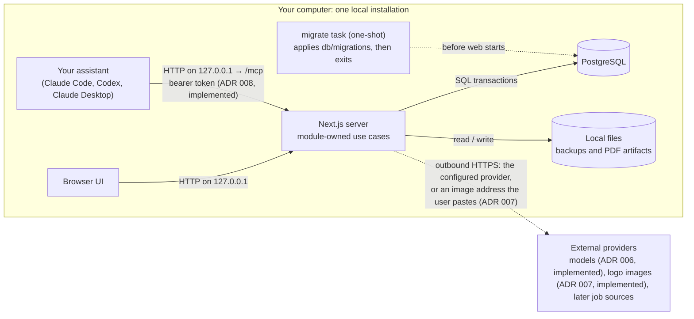
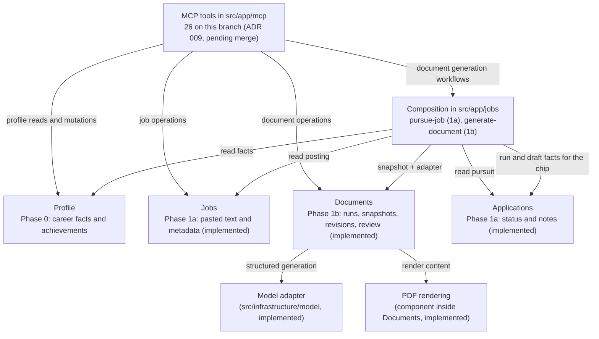

# 03 — System and modules

Status: stack, Profile, Jobs and Applications modules and packaged runtime implemented; Documents module, model adapter and PDF rendering implemented (Phase 1b, ADR 006); the assistant surface at `/mcp` and the Host and Origin guard implemented ([ADR 008](adr/008-assistant-surface-over-mcp.md), 2026-09-16). Updated 2026-09-17.

Profile management under [ADR 009](adr/009-profile-management-over-mcp.md) is implemented and locally accepted on this branch, pending merge. See [current verification](09-decisions-and-readiness.md#profile-management-over-mcp-accepted-pending-merge).

## System boundary

The browser connects to a local Next.js server. Server-side application operations validate requests and use PostgreSQL. The packaged installation (`compose.release.yml`, started by `scripts/landed.sh`) runs three Compose services: `db` (pinned PostgreSQL 17 image, named volume, no host port), `migrate` (a one-shot task that builds the application image and applies `db/migrations` through `db/migrate.mjs`, then exits) and `web` (the same image, started only after `migrate` succeeds and `db` is healthy, published on 127.0.0.1 only). Contributor mode is different: `docker-compose.yml` runs only PostgreSQL, published on 127.0.0.1:5432, and Next.js runs from the checkout with `pnpm dev`. The two Compose projects have separate names and volumes.

This is a modular application plus its database, not a collection of microservices. Browser rendering and server execution remain separate even though Next.js supplies both. Next.js uses React; Vite is an alternative build/dev tool, not a React replacement.

Runtime view:



This is a logical runtime view: PostgreSQL is a process/container with its own volume, and the `migrate` task is a Compose service that runs once per `start` rather than a product component. The diagram abstracts volumes and networks.

Phase 0 and 1a have no runtime network dependency beyond local processes. Installation/image downloads require internet. From Phase 1b the web service makes outbound HTTPS calls to the model provider configured in the environment file, and only then; with no provider configured, Landed makes no model request itself. The assistant used for paste-back or MCP may send supplied facts to its own provider. The one other outbound call is user-initiated: pasting an image address for a job's logo fetches that address once, through the guarded fetcher in `src/infrastructure/fetch` ([ADR 007](adr/007-user-initiated-image-fetch.md)). Later job/search providers require outbound access too.

The assistant surface ([ADR 008](adr/008-assistant-surface-over-mcp.md), implemented 2026-09-16) is an inbound connection, not an outbound one: the user's own assistant on the host computer calls `POST /mcp` on the same port the browser uses, with the bearer token `LANDED_MCP_TOKEN` from the environment file (minted by the launcher for the packaged installation), and Landed's tools call module operations through the composition layer. Two rules then apply to the whole application, not only to `/mcp`: every request's `Host` must be `localhost`, `127.0.0.1` or `::1` (or a name listed in `LANDED_ALLOWED_HOSTS`, empty until a remote design uses it), and an `Origin` header, when present, must name one of the same hosts; any other request is refused with 403 before a handler runs, because the Settings column shows the token and a server that answered any `Host` could be read through DNS rebinding. LAN or public access, and remote MCP from claude.ai or a phone, still require a separate access and security design.

The root layout initializes the saved theme and palette with Next.js `Script` using `beforeInteractive`. Static sidebar brand images are served directly (`unoptimized`), because the image optimizer's internal requests do not carry the Host header required by the guard.

## Ownership and dependencies

Phase 0/1 module boundaries:



Arrows are code calls or dependencies, not HTTP connections or deployment boundaries. Jobs and Applications are implemented; in Phase 1a Applications only stores a job id and the two are joined by the composition code in `src/app`. In Phase 1b the composition function in `src/app/jobs` reads the profile, the job and the application, builds the input snapshot as plain data, and hands it with the adapter to Documents, so Documents depends on none of the other modules' code. Matching, Research and Discovery enter in Phase 2 and 3.

| Module | Owns | May depend on |
|---|---|---|
| Profile | Career records, skills, editable achievements | Database adapter |
| Jobs (implemented) | Raw pasted posting, title, company, location, salary, source URL, availability, the logo file and its metadata | Database adapter and the artifact directory; later import adapters |
| Documents (implemented) | Generation runs, input snapshots, saved revisions, grounding warnings, review state, artifact metadata, PDF rendering | The model adapter interface and the artifact directory; receives snapshots as data, imports no other module |
| Applications (implemented) | Pursuit status, notes, submission time, the derived job status rule; pinning the exact revisions used for a submission is deferred (document 09) | Stores a job id; the composition in `src/app/jobs/list-jobs.ts` feeds it run and draft facts read from Documents |
| Matching (later) | Eligibility checks and explained assessments | Profile and Jobs reads, model/retrieval adapters |
| Research (later) | Sourced findings and bounded research runs | Jobs reads, search/fetch adapters, model runtime |
| Discovery (later) | Provider adapters, schedules, ingestion runs | Jobs write operations; orchestration can then invoke Matching/Documents |

PDF rendering is a small component within Documents initially, not a separately deployed service. It converts validated structured content through templates into PDFs. Extract an independent package only if real reuse or isolation needs emerge. Model integration is infrastructure, not a business module that knows how resumes work: `src/infrastructure/model/` holds the `ModelAdapter` interface (a structured-output request with a Zod schema in, a validated value with usage or a classified failure out), the AI SDK implementation as a class holding the configured provider client, the fake adapter that answers from `examples/generation`, and the factory that reads the environment ([ADR 006](adr/006-model-access-path.md)). The Model setup column under `/settings/model` reads the same configuration and shows its status without the key. The assistant surface (ADR 008) is the other adapter over the same composition functions: `src/app/mcp/` holds the route (`route.ts`), the SDK handler (`handler.ts`), the tool registrations (`tools.ts` and `profile-tools.ts`; profile management extends them under ADR 009, pending merge), the bearer check (`auth.ts`) and the projections (`serialize.ts`); `src/proxy.ts` applies the Host and Origin guard from `src/infrastructure/host-guard.ts`; and the runtime configuration has `LANDED_MCP_TOKEN` and `LANDED_ALLOWED_HOSTS` next to the model variables, read from the environment only, the token shown in the browser solely on the Connect your assistant column under `/settings/assistant`.

Keep cross-module workflows at an application composition boundary; avoid circular imports. The implemented example is `src/app/jobs/pursue-job.ts`: pasting a posting must create the job and its application together, so the function opens one transaction and passes the handle to the Jobs and Applications use cases, whose own transactions nest as savepoints inside it; a failure in either rolls back both. Neither module imports the other, and the owner-aware foreign key in the database checks the link. Documents likewise stores an opaque application id without importing Applications operations; `src/app/jobs/generate-document.ts` coordinates reading the pursuit, building the snapshot and generating a document. Database foreign keys do not mandate circular code dependencies.

## Repository shape

```text
src/
  app/                   Next.js routes; the path is the navigation stack (DESIGN.md "Layout")
    layout.tsx           the Shell: sidebar or drawer plus the row of columns
    about/               hub column (layout.tsx) with one card per record type
      profile/           the profile form column
      work-history/ education/ projects/ skills/ achievements/
                         each: layout.tsx (list column + add control), page.tsx (placeholder),
                         new/page.tsx (blank form column), [id]/page.tsx (edit column with delete),
                         actions.ts (Server Actions) and the form component
    jobs/                layout.tsx (list column; the client JobList and JobListControls apply the
                         filter and sort search parameters), page.tsx (placeholder), new/page.tsx
                         (paste form), [id]/layout.tsx (job column: status form, blocks, delete),
                         [id]/page.tsx (renders nothing), [id]/description/ and [id]/company/,
                         actions.ts, pursue-job.ts (composition), list-jobs.ts, list-params.ts
    jobs/[id]/resume/ cover-letter/ recruiter-message/
                         layout.tsx (review column with inline editing), page.tsx (null),
                         evidence/, paste/, runs/ columns, pdf/route.ts download; document-actions.ts,
                         generate-document.ts and snapshot.ts (composition)
    settings/            layout.tsx (the hub: Model setup and Connect your assistant cards), page.tsx (placeholder),
                         model/ (Model setup column, configuration status, no key), assistant/ (Connect your
                         assistant column: one copyable block per assistant, the only place the token is shown)
    mcp/                 route.ts (POST /mcp: 503 without a token, 401 on a wrong bearer), handler.ts (the SDK
                         handler, no Next imports), tools.ts and profile-tools.ts (tool registrations), auth.ts (constant-time bearer
                         compare), serialize.ts (projections)
    form-state.ts        shared action result shape and form helpers
    palettes.css         the palettes (every colour as a light and a dark value; steel is the default)
    tokens.css           semantic tokens from DESIGN.md: colours picked from the palette by scheme, plus sizes, radii, spacing, type, motion
    icon.png, apple-icon.png
                         the favicon and touch icon generated from the mark in public/logo
  modules/
    shared/              contracts.ts (Result, ModuleError, field helpers), service.ts (BaseDeps, error mapping), files.ts (checksum, atomic write, quiet unlink)
    profile/             schema.ts, contracts.ts, rules.ts, repository.ts, service.ts, index.ts
    jobs/                same shape plus logo.ts (logo files under the artifact directory, row after file) and stopwords.ts (word cloud)
    applications/        same shape; pursuits and the derived job status rule
    documents/           same shape plus prompts/ (versioned prompt builders), pdf/ (templates) and artifacts.ts
  proxy.ts               runs before every request: 403 unless Host and Origin name this computer (ADR 008)
  components/            shared presentation components (Shell, SidebarNav, ThemeToggle, Drawer, Column, Toolbar, ToolbarMenu, Card, IconTile, LogoPicker, WordCloud, Field, CopyButton, AutoGrowTextarea, ...)
  infrastructure/        database pool, configuration, model/ (adapter interface, AI SDK class, fake, factory), fetch/ (guarded image fetch, ADR 007), host-guard.ts (pure Host and Origin check)
db/migrations/           generated SQL migrations and drizzle-kit journal
db/migrate.mjs           migration runner used inside the release image (production dependencies only)
db/init/                 creates the test database on first start of the development database
docker-compose.yml       development database only
Dockerfile               multi-stage release image (Next.js standalone output, non-root user)
compose.release.yml      packaged installation: db, migrate, web
scripts/                 landed.sh / landed.ps1 launcher; db-backup.sh / db-restore.sh for contributors;
                         check-migrations.sh (drift) and check-skill-sync.sh (the plugin's copy of the skill)
.agents/skills/landed/   SKILL.md, the assistant workflow (single source; Codex reads it here)
plugins/landed/          the Claude Code plugin: manifest, .mcp.json, a copy of the skill
.claude-plugin/          marketplace.json publishing that plugin
tests/integration/       Vitest against real PostgreSQL
tests/e2e/               Playwright browser journeys
examples/                synthetic data; generation/ holds the evaluation cases and fixtures (Phase 1b)
tests/eval/               the evaluation cases against the configured real provider (pnpm eval, never in CI)
docs/                    numbered design and ADRs
```

Inside a module: `schema.ts` declares tables, `contracts.ts` holds Zod input schemas and result types (browser-safe), `rules.ts` holds pure functions, `repository.ts` holds Drizzle queries over a database or transaction handle, `service.ts` holds use cases that open transactions and map database errors to typed results, and `index.ts` is the only import path for callers. Layouts render their own column followed by `children`, so a route like `/about/achievements/[id]` produces the hub, the list and the edit form as sibling columns and CSS shows the last two (one on a phone); the old Phase 0 addresses redirect to their new columns from `next.config.ts`. Server Actions in `src/app` import from `index.ts`; a client component that needs a contract imports `contracts.ts` directly so no database code reaches the browser bundle.

Documents has the same file shape plus `prompts/` (one versioned prompt builder per document type), `pdf/` (the two react-pdf templates and the renderer) and `artifacts.ts` (atomic file writes under `LANDED_ARTIFACT_DIR`, a named volume in the packaged installation, with metadata rows inserted only after the file exists). The PDF downloads are the first Route Handlers in the app (`pdf/route.ts` under the resume and cover-letter routes), because a file download is not a form submission.

Framework handlers translate requests, validate transport input, invoke operations, and return useful errors. Domain rules live in modules. Database constraints back up critical rules. Persistence uses Drizzle: the schema is TypeScript, queries stay close to SQL, and migrations are generated as reviewable SQL files ([ADR 004](adr/004-drizzle-persistence.md)). Do not maintain multiple persistence implementations for hypothetical portability.

## Sources

- [Next.js](https://nextjs.org/docs) — React framework with server capabilities.
- [Vite](https://vite.dev/guide/) — frontend development/build tooling.
- [Docker Compose](https://docs.docker.com/compose/intro/compose-application-model/) — services, networks, volumes, and application configuration.

## Profile adapter extension (ADR 009, pending merge)

The profile tools use the existing MCP transport and configuration. They resolve the profile for each call and invoke public Profile operations with explicit dependencies. Partial updates and version checks live inside Profile transactions, not in the MCP adapter. Reads project selected sections with snake_case fields and ISO timestamps. The browser and assistant therefore share ownership and validation rules, while the assistant gets a patch contract appropriate for conversational edits. No new worker, provider call or remote service is required.


Career browsing refinement (local, ADR 010): `ExpandableCard` owns native disclosure presentation and a separate named edit link. `RecordCards` supplies shared read-only career details to the overview and lists. Client `CareerList` components read scoped URL filter parameters over server-loaded records, with pure context derivation in `context-filters.ts`. The Profile module owns direct skill context writes and coherent aggregate reads; MCP adapts the same public operations. `PillInput` retains the existing profile form/storage contract. The document column separates header actions, supporting links and a wrapping generation/approval row.
