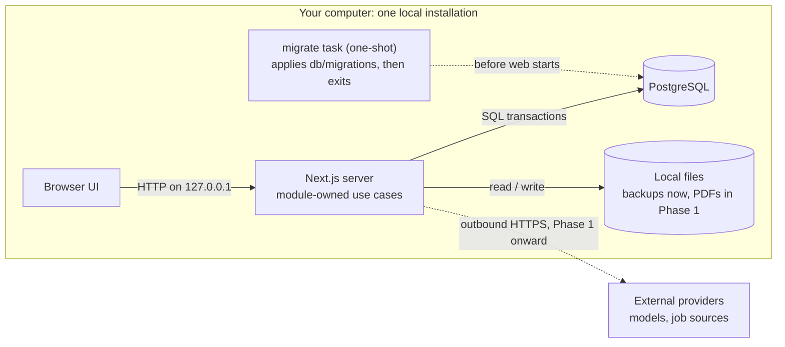
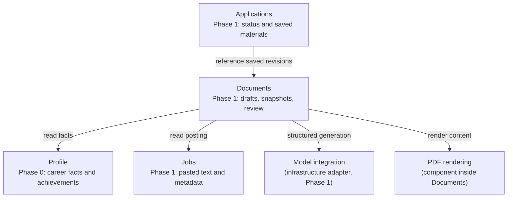

# 03 — System and modules

Status: stack, Profile module and packaged runtime implemented; Phase 1 modules proposed. Updated 2026-09-13.

## System boundary

The browser connects to a local Next.js server. Server-side application operations validate requests and use PostgreSQL. The packaged installation (`compose.release.yml`, started by `scripts/landed.sh`) runs three Compose services: `db` (pinned PostgreSQL 17 image, named volume, no host port), `migrate` (a one-shot task that builds the application image and applies `db/migrations` through `db/migrate.mjs`, then exits) and `web` (the same image, started only after `migrate` succeeds and `db` is healthy, published on 127.0.0.1 only). Contributor mode is different: `docker-compose.yml` runs only PostgreSQL, published on 127.0.0.1:5432, and Next.js runs from the checkout with `pnpm dev`. The two Compose projects have separate names and volumes.

This is a modular application plus its database, not a collection of microservices. Browser rendering and server execution remain separate even though Next.js supplies both. Next.js uses React; Vite is an alternative build/dev tool, not a React replacement.

Runtime view:



This is a logical runtime view: PostgreSQL is a process/container with its own volume, and the `migrate` task is a Compose service that runs once per `start` rather than a product component. The diagram abstracts volumes and networks.

Phase 0 has no runtime network dependency beyond local processes. Installation/image downloads require internet. Later external models and job/search providers require outbound access; a locally launched harness can still use a cloud model. LAN/public access and remote MCP require a separate access/security design.

## Ownership and dependencies

Phase 0/1 module boundaries:



Arrows are code calls or dependencies, not HTTP connections or deployment boundaries. Matching, Research and Discovery enter in Phase 2 and 3.

| Module | Owns | May depend on |
|---|---|---|
| Profile | Career records, skills, editable achievements | Database adapter |
| Jobs | Raw posting, metadata, normalized fields | Database adapter; later import adapters |
| Documents | Generation coordination, saved revisions, input snapshots, review, artifact metadata | Profile/Jobs read operations, model adapter, PDF renderer, file storage |
| Applications | Pursuit status, notes, submission record, exact material references | Jobs and Documents read operations |
| Matching (later) | Eligibility checks and explained assessments | Profile and Jobs reads, model/retrieval adapters |
| Research (later) | Sourced findings and bounded research runs | Jobs reads, search/fetch adapters, model runtime |
| Discovery (later) | Provider adapters, schedules, ingestion runs | Jobs write operations; orchestration can then invoke Matching/Documents |

PDF rendering is a small component within Documents initially, not a separately deployed service. It converts validated structured content through templates into PDFs. Extract an independent package only if real reuse or isolation needs emerge. Model integration is infrastructure, not a business module that knows how resumes work.

Keep cross-module workflows at an application composition boundary; avoid circular imports. Documents can store an opaque application ID without importing Applications operations; an application-level use case coordinates creating the application and generating its materials. Database foreign keys do not mandate circular code dependencies.

## Repository shape

```text
src/
  app/                   Next.js routes; each route folder holds its page, Server Actions and form
    profile/ experience/ skills/ achievements/
    form-state.ts        shared action result shape and form helpers
    tokens.css           design tokens from DESIGN.md (the only place values live)
  modules/
    profile/             schema.ts, contracts.ts, rules.ts, repository.ts, service.ts, index.ts
  components/            shared presentation components (Card, Field, Select, NavBar, ...)
  infrastructure/        database pool, configuration
db/migrations/           generated SQL migrations and drizzle-kit journal
db/migrate.mjs           migration runner used inside the release image (production dependencies only)
db/init/                 creates the test database on first start of the development database
docker-compose.yml       development database only
Dockerfile               multi-stage release image (Next.js standalone output, non-root user)
compose.release.yml      packaged installation: db, migrate, web
scripts/                 landed.sh / landed.ps1 launcher; db-backup.sh / db-restore.sh for contributors
tests/integration/       Vitest against real PostgreSQL
tests/e2e/               Playwright browser journeys
examples/                synthetic data
docs/                    numbered design and ADRs
```

Inside a module: `schema.ts` declares tables, `contracts.ts` holds Zod input schemas and result types (browser-safe), `rules.ts` holds pure functions, `repository.ts` holds Drizzle queries over a database or transaction handle, `service.ts` holds use cases that open transactions and map database errors to typed results, and `index.ts` is the only import path for callers. Server Actions in `src/app` import from `index.ts`; a client component that needs a contract imports `contracts.ts` directly so no database code reaches the browser bundle.

Add Jobs, Documents, and Applications when Phase 1 begins, with the same file shape.

Framework handlers translate requests, validate transport input, invoke operations, and return useful errors. Domain rules live in modules. Database constraints back up critical rules. Persistence uses Drizzle: the schema is TypeScript, queries stay close to SQL, and migrations are generated as reviewable SQL files ([ADR 004](adr/004-drizzle-persistence.md)). Do not maintain multiple persistence implementations for hypothetical portability.

## Sources

- [Next.js](https://nextjs.org/docs) — React framework with server capabilities.
- [Vite](https://vite.dev/guide/) — frontend development/build tooling.
- [Docker Compose](https://docs.docker.com/compose/intro/compose-application-model/) — services, networks, volumes, and application configuration.
