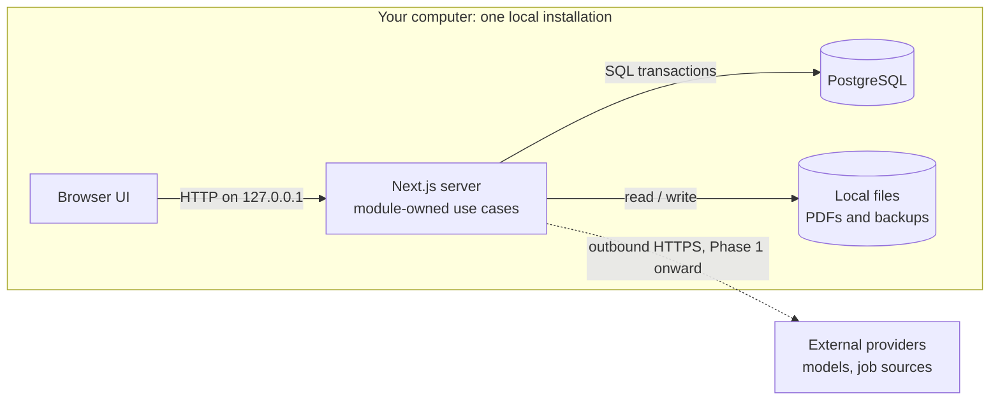
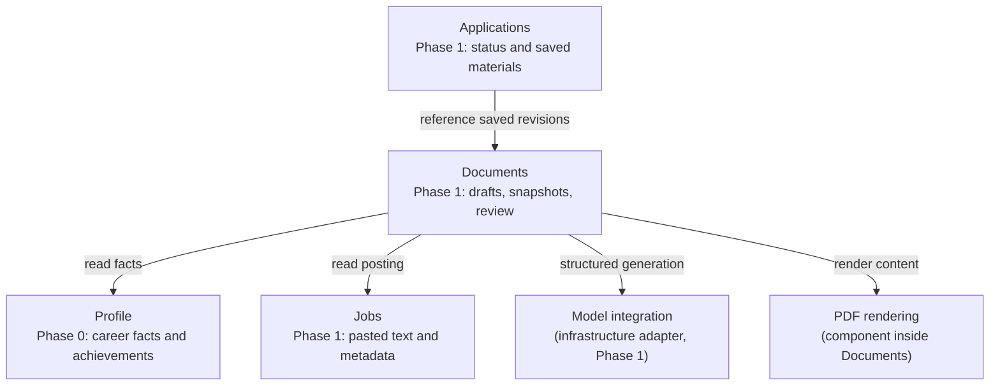

# 03 — System and modules

Status: TypeScript, Next.js, Node.js, PostgreSQL accepted. Packaging and boundaries proposed. Updated 2026-09-13.

## System boundary

The browser connects to a local Next.js server. Server-side application operations validate requests and use PostgreSQL. The packaged installation should run Next.js and PostgreSQL through Docker Compose, with persistent volumes and only the web port published on loopback. PostgreSQL is not exposed on the host in the default user installation. A development-only configuration may expose it locally.

This is a modular application plus its database, not a collection of microservices. Browser rendering and server execution remain separate even though Next.js supplies both. Next.js uses React; Vite is an alternative build/dev tool, not a React replacement.

Runtime view:



This is a logical runtime view: PostgreSQL is a process/container with its own volume. The diagram abstracts volumes and the one-time migration task rather than pretending they are extra product services.

Phase 0 has no runtime network dependency beyond local processes. Installation/image downloads require internet. Later external models and job/search providers require outbound access; a locally launched harness can still use a cloud model. LAN/public access and remote MCP require a separate access/security design.

## Ownership and dependencies

Phase 0/1 module boundaries:



Arrows are code calls or dependencies, not HTTP connections or deployment boundaries. Matching, Research and Discovery enter in Phase 2 and 3.

| Module | Owns | May depend on |
|---|---|---|
| Profile | Career records, skills, editable achievements | Database adapter |
| Jobs | Raw posting, metadata, normalized fields | Database adapter; later import adapters |
| Documents | Generation coordination, saved revisions, input snapshots, review, artifact metadata | Profile/Jobs read operations, model adapter, PDF renderer, file storage |
| Applications | Pursuit status, notes, submission record, exact material references | Jobs and Documents read operations |
| Matching (later) | Eligibility checks and explained assessments | Profile and Jobs reads, model/retrieval adapters |
| Research (later) | Sourced findings and bounded research runs | Jobs reads, search/fetch adapters, model runtime |
| Discovery (later) | Provider adapters, schedules, ingestion runs | Jobs write operations; orchestration can then invoke Matching/Documents |

PDF rendering is a small component within Documents initially, not a separately deployed service. It converts validated structured content through templates into PDFs. Extract an independent package only if real reuse or isolation needs emerge. Model integration is infrastructure, not a business module that knows how resumes work.

Keep cross-module workflows at an application composition boundary; avoid circular imports. Documents can store an opaque application ID without importing Applications operations; an application-level use case coordinates creating the application and generating its materials. Database foreign keys do not mandate circular code dependencies.

## Repository shape (planned, not scaffolded)

```text
src/
  app/                   Next.js routes, pages, composition
  modules/
    profile/             Phase 0 rules, use cases, persistence
  components/            shared presentation components
  infrastructure/        database connection, configuration, file storage
db/migrations/           versioned database schema changes
tests/                   integration and browser journeys
examples/                synthetic data
docs/                    numbered design and ADRs
```

Add Jobs, Documents, and Applications when Phase 1 begins. A module can start with a few files (`contracts`, `service`, `repository`) rather than nested empty layers. Module entry points expose operations; callers do not import another module's repository or mutate its tables. Shared contracts must not import server-only database/SDK code into browser bundles.

Framework handlers translate requests, validate transport input, invoke operations, and return useful errors. Domain rules live in modules. Database constraints back up critical rules. Persistence uses Drizzle: the schema is TypeScript, queries stay close to SQL, and migrations are generated as reviewable SQL files ([ADR 004](adr/004-drizzle-persistence.md)). Do not maintain multiple persistence implementations for hypothetical portability.

## Sources

- [Next.js](https://nextjs.org/docs) — React framework with server capabilities.
- [Vite](https://vite.dev/guide/) — frontend development/build tooling.
- [Docker Compose](https://docs.docker.com/compose/intro/compose-application-model/) — services, networks, volumes, and application configuration.
