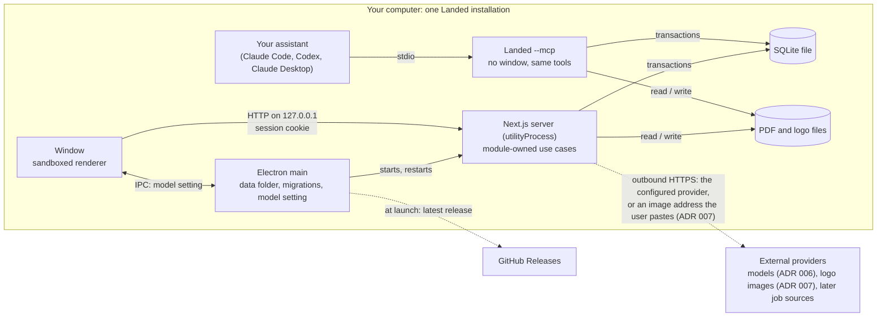
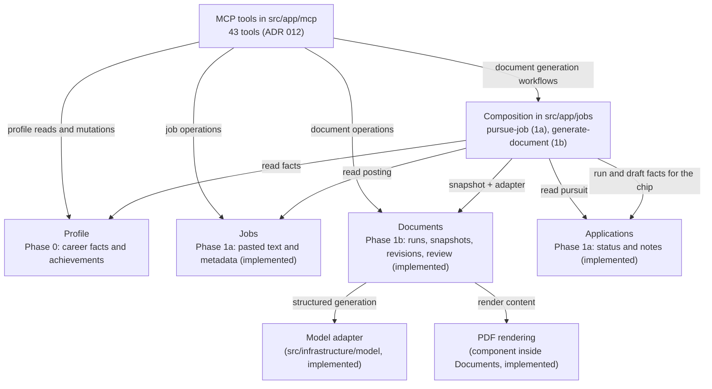

# 03 — System and modules

Status: stack, modules, model adapter and PDF rendering implemented; the desktop app, SQLite and the assistant surface over stdio implemented ([ADR 013](adr/013-desktop-distribution.md), 2026-10-02). Updated 2026-10-02.

Profile management under [ADR 009](adr/009-profile-management-over-mcp.md) is merged. The ADR 011 writing-context and canonical-company extensions are implemented and merged in PRs #43–47 (2026-09-23). See [current verification](09-decisions-and-readiness.md#smaller-pr-stack-verification-2026-09-23).

## System boundary

Landed is an Electron desktop app ([ADR 013](adr/013-desktop-distribution.md)). The main process (`desktop/main.ts`) is a thin supervisor: it keeps the data in the app's data folder (`landed.db`, `artifacts/`, `backups/`), runs pending migrations through `src/infrastructure/migrate.ts` after a backup, starts the Next.js standalone server in a `utilityProcess` on a free 127.0.0.1 port and opens one sandboxed window on it. Server-side operations validate requests and use the SQLite file. Started with `--mcp`, the same executable opens no window and serves the assistant tools over stdio on the same database and artifact folder. Contributors run `pnpm dev` from the checkout against `./data/landed.db`, and `pnpm mcp` for the stdio server.

This is a modular application plus its database file, not a collection of microservices. Browser rendering and server execution remain separate even though Next.js supplies both.

Runtime view:


```mermaid
flowchart LR
  subgraph local["Your computer: one Landed installation"]
    main["Electron main<br/>data folder, migrations, model setting"]
    window["Window<br/>sandboxed renderer"]
    app["Next.js server (utilityProcess)<br/>module-owned use cases"]
    stdio["Landed --mcp<br/>no window, same tools"]
    main -->|"starts, restarts"| app
    window -->|"HTTP on 127.0.0.1<br/>session cookie"| app
    window <-->|"IPC: model setting"| main
    assistant["Your assistant<br/>(Claude Code, Codex, Claude Desktop)"] -->|"stdio"| stdio
    app -->|"transactions"| db[("SQLite file")]
    stdio -->|"transactions"| db
    app -->|"read / write"| files[("PDF and logo files")]
    stdio -->|"read / write"| files
  end
  app -.->|"outbound HTTPS: the configured provider,<br/>or an image address the user pastes (ADR 007)"| providers["External providers<br/>models (ADR 006), logo images (ADR 007), later job sources"]
  main -.->|"at launch: latest release"| github["GitHub Releases"]
```

The app makes no network request except to the model provider configured in Settings (and only then; with no provider configured, Landed makes no model request itself), to an image address the user pastes for a company logo, fetched once through the guarded fetcher in `src/infrastructure/fetch` ([ADR 007](adr/007-user-initiated-image-fetch.md)), and, once per launch of the installed app, to GitHub for the latest release. The assistant used for paste-back or MCP may send supplied facts to its own provider. Later job/search providers require outbound access too.

The assistant surface ([ADR 008](adr/008-assistant-surface-over-mcp.md), transport from ADR 013) needs no network listener and no token: the harness starts `Landed --mcp` (or `pnpm mcp` from a checkout) and is the only party on that process's stdin and stdout. The server answers only the window: when `LANDED_SESSION_SECRET` is set (the desktop app mints one per launch and puts it in an `HttpOnly`, `SameSite=Strict` cookie on its own window), `src/proxy.ts` refuses with 403 any request without a `landed_session` cookie equal to it (`src/infrastructure/session-guard.ts`, a constant-time compare of SHA-256 digests). Before that, every request's `Host` must be `localhost`, `127.0.0.1` or `::1` (or a name listed in `LANDED_ALLOWED_HOSTS`, empty until a remote design uses it), and an `Origin` header, when present, must name one of the same hosts, which defeats DNS rebinding. `pnpm dev` sets no session secret, so the contributor server relies on the Host guard alone. LAN or public access, and remote MCP from claude.ai or a phone, require a separate access and security design.

Runtime configuration is read from the environment only. The desktop main process sets `LANDED_DATABASE_PATH`, `LANDED_ARTIFACT_DIR`, `LANDED_SESSION_SECRET`, `LANDED_EXECUTABLE_PATH` (shown on the Connect your assistant column), `LANDED_DESKTOP=1` (Model setup shows the form instead of environment-file recipes) and the `LANDED_MODEL_*` variables from the saved model setting; a checkout reads `.env` (`.env.example`).

The root layout initializes the saved theme and palette with Next.js `Script` using `beforeInteractive`. Static sidebar brand images are served directly (`unoptimized`), because the image optimizer's internal requests do not carry the Host header required by the guard.

## Ownership and dependencies

Phase 0/1 module boundaries:


```mermaid
flowchart TB
  model["Model adapter<br/>(src/infrastructure/model, implemented)"]
  pdf["PDF rendering<br/>(component inside Documents, implemented)"]
  profile["Profile<br/>Phase 0: career facts and achievements"]
  jobs["Jobs<br/>Phase 1a: pasted text and metadata (implemented)"]
  documents["Documents<br/>Phase 1b: runs, snapshots, revisions, review (implemented)"]
  applications["Applications<br/>Phase 1a: status and notes (implemented)"]
  compose["Composition in src/app/jobs<br/>pursue-job (1a), generate-document (1b)"]
  mcp["MCP tools in src/app/mcp<br/>43 tools (ADR 012)"]
  mcp -->|"profile reads and mutations"| profile
  mcp -->|"document generation workflows"| compose
  mcp -->|"job operations"| jobs
  mcp -->|"document operations"| documents
  compose -->|"read facts"| profile
  compose -->|"read posting"| jobs
  compose -->|"read pursuit"| applications
  compose -->|"snapshot + adapter"| documents
  documents -->|"structured generation"| model
  documents -->|"render content"| pdf
  compose -->|"run and draft facts for the chip"| applications
```

Arrows are code calls or dependencies, not HTTP connections or deployment boundaries. Jobs and Applications are implemented; in Phase 1a Applications only stores a job id and the two are joined by the composition code in `src/app`. In Phase 1b the composition function in `src/app/jobs` reads the profile, the job and the application, builds the input snapshot as plain data, and hands it with the adapter to Documents, so Documents depends on none of the other modules' code. Matching, Research and Discovery enter in Phase 2 and 3.

| Module | Owns | May depend on |
|---|---|---|
| Profile | Career records, skills, editable achievements | Database adapter |
| Jobs (implemented) | Raw pasted posting, title, canonical company/source links, location, salary, source URL, availability and selected company findings | Database adapter; later import adapters |
| Companies (implemented) | Canonical name, location, website, About, sourced findings and shared company logo files/metadata | Database adapter, artifact directory and guarded image fetch through application composition |
| Documents (implemented) | Generation runs, input snapshots, saved revisions, grounding warnings, review state, artifact metadata, PDF rendering | The model adapter interface and the artifact directory; receives snapshots as data, imports no other module |
| Applications (implemented) | Pursuit status, notes, submission time, the derived job status rule; pinning the exact revisions used for a submission is deferred (document 09) | Stores a job id; the composition in `src/app/jobs/list-jobs.ts` feeds it run and draft facts read from Documents |
| Matching (later) | Eligibility checks and explained assessments | Profile and Jobs reads, model/retrieval adapters |
| Research (later) | Sourced findings and bounded research runs | Jobs reads, search/fetch adapters, model runtime |
| Discovery (later) | Provider adapters, schedules, ingestion runs | Jobs write operations; orchestration can then invoke Matching/Documents |

PDF rendering is a small component within Documents initially, not a separately deployed service. It converts validated structured content through templates into PDFs. Extract an independent package only if real reuse or isolation needs emerge. Model integration is infrastructure, not a business module that knows how resumes work: `src/infrastructure/model/` holds the `ModelAdapter` interface (a structured-output request with a Zod schema in, a validated value with usage or a classified failure out), the AI SDK implementation as a class holding the configured provider client, the fake adapter that answers from `examples/generation`, and the factory that reads the environment ([ADR 006](adr/006-model-access-path.md)). The Model setup column under `/settings/model` reads the same configuration and shows its status without the key; in the desktop app it also saves the setting through the window's one IPC bridge (`desktop/preload.ts`), and main keeps the key encrypted with the OS keychain (`desktop/model-settings.ts`). The assistant surface (ADR 008) is the other adapter over the same composition functions: `src/app/mcp/` holds the stdio entry (`stdio.ts`, which migrates first), the server factory (`server.ts`, no Next imports), the tool registrations (`tools.ts`, `profile-tools.ts`, `company-tools.ts` and `job-source-tools.ts`) and the projections (`serialize.ts`); `src/proxy.ts` applies the Host and Origin guard from `src/infrastructure/host-guard.ts` and the session check from `src/infrastructure/session-guard.ts`.

Keep cross-module workflows at an application composition boundary; avoid circular imports. The implemented example is `src/app/jobs/pursue-job.ts`: pasting a posting must create the job and its application together, so the function opens one transaction and passes the handle to the Jobs and Applications use cases, whose own transactions nest as savepoints inside it; a failure in either rolls back both. Neither module imports the other, and the owner-aware foreign key in the database checks the link. Documents likewise stores an opaque application id without importing Applications operations; `src/app/jobs/generate-document.ts` coordinates reading the pursuit, building the snapshot and generating a document. Database foreign keys do not mandate circular code dependencies.

## Repository shape

```text
src/
  app/                   Next.js routes; the path is the navigation stack (DESIGN.md "Layout")
    layout.tsx           the Shell: sidebar or drawer plus the row of columns
    about/               hub column (layout.tsx) with one card per record type
      profile/           the profile form column
      work-history/ education/ projects/ skills/ achievements/
                         each: layout.tsx (list column + add control), page.tsx (placeholder),
                         new/page.tsx (blank form column), [id]/page.tsx (edit column with delete),
                         actions.ts (Server Actions) and the form component
    jobs/                layout.tsx (list column; the client JobList and JobListControls apply the
                         filter and sort search parameters), page.tsx (placeholder), new/page.tsx
                         (paste form), [id]/layout.tsx (job column: status form, blocks, delete),
                         [id]/page.tsx (renders nothing), [id]/description/ and [id]/company/,
                         actions.ts, pursue-job.ts (composition), list-jobs.ts, list-params.ts
    jobs/[id]/resume/ cover-letter/ recruiter-message/
                         layout.tsx (review column with inline editing), page.tsx (null),
                         evidence/, paste/, runs/ columns, pdf/route.ts download; document-actions.ts,
                         generate-document.ts and snapshot.ts (composition)
    settings/            layout.tsx (the hub), page.tsx (placeholder), model/ (Model setup column: status,
                         and the form in the desktop app), assistant/ (Connect your assistant column: one
                         copyable stdio registration per assistant), job-sources/
    mcp/                 stdio.ts (migrate, then serve), server.ts (the MCP server, no Next imports),
                         tools.ts, profile-tools.ts, company-tools.ts, job-source-tools.ts, serialize.ts
    form-state.ts        shared action result shape and form helpers
    palettes.css         the palettes (every colour as a light and a dark value; steel is the default)
    tokens.css           semantic tokens from DESIGN.md: colours picked from the palette by scheme, plus sizes, radii, spacing, type, motion
    icon.png, apple-icon.png
                         the favicon and touch icon generated from the mark in public/logo
  modules/
    shared/              contracts.ts (Result, ModuleError, field helpers), service.ts (BaseDeps, error mapping), files.ts (checksum, atomic write, quiet unlink)
    profile/             schema.ts, contracts.ts, rules.ts, repository.ts, service.ts, index.ts
    jobs/                same shape plus stopwords.ts (word cloud); owns job links and finding selections
    companies/           same shape plus company logo storage; files under the artifact directory, row after file
    applications/        same shape; pursuits and the derived job status rule
    documents/           same shape plus prompts/ (versioned prompt builders), pdf/ (templates) and artifacts.ts
  proxy.ts               runs before every request: 403 unless Host and Origin name this computer and,
                         in the desktop app, the request carries the session cookie
  components/            shared presentation components (Shell, SidebarNav, ThemeToggle, Drawer, Column, Toolbar, ToolbarMenu, Card, IconTile, LogoPicker, WordCloud, Field, CopyButton, AutoGrowTextarea, ...)
  infrastructure/        sqlite.ts (connections, runInTransaction), database.ts, migrate.ts (backup, newer-database
                         refusal, migrations), config.ts, server.ts, session-guard.ts, host-guard.ts,
                         model/ (adapter interface, AI SDK class, fake, factory), fetch/ (guarded image fetch, ADR 007)
desktop/                 Electron main.ts, preload.ts, model-settings.ts, updates.ts, mcp.ts (pnpm mcp),
                         build.mjs (esbuild bundles), resources/ (icon)
electron-builder.yml     installers: dmg (macOS), NSIS (Windows), AppImage (Linux)
db/migrations/           generated SQL migrations, one folder per migration (migration.sql, snapshot.json)
db/migrate.mjs           applies them to the contributor database (pnpm db:migrate)
scripts/                 db-backup.mjs / db-restore.mjs, import-postgres.mjs (one-time import from a Docker
                         installation), smoke-mcp.mjs (release smoke test), check-migrations.sh (drift),
                         check-skill-sync.sh (the plugin's copy of the skill)
.github/workflows/       ci.yml (checks on every pull request), release.yml (installers from a v* tag)
.agents/skills/landed/   SKILL.md, the assistant workflow (single source; Codex reads it here)
plugins/landed/          the Claude Code plugin: manifest, .mcp.json, a copy of the skill
.claude-plugin/          marketplace.json publishing that plugin
tests/integration/       Vitest against temporary SQLite files, the stdio server included
tests/e2e/               Playwright browser journeys
examples/                synthetic data; generation/ holds the evaluation cases and fixtures (Phase 1b)
tests/eval/               the evaluation cases against the configured real provider (pnpm eval, never in CI)
docs/                    numbered design and ADRs
```

Inside a module: `schema.ts` declares tables, `contracts.ts` holds Zod input schemas and result types (browser-safe), `rules.ts` holds pure functions, `repository.ts` holds Drizzle queries over a database or transaction handle, `service.ts` holds use cases that open transactions and map database errors to typed results, and `index.ts` is the only import path for callers. Layouts render their own column followed by `children`, so a route like `/about/achievements/[id]` produces the hub, the list and the edit form as sibling columns and CSS shows the last two (one on a phone); the old Phase 0 addresses redirect to their new columns from `next.config.ts`. Server Actions in `src/app` import from `index.ts`; a client component that needs a contract imports `contracts.ts` directly so no database code reaches the browser bundle.

Documents has the same file shape plus `prompts/` (one versioned prompt builder per document type), `pdf/` (the two react-pdf templates and the renderer) and `artifacts.ts` (atomic file writes under `LANDED_ARTIFACT_DIR`, the app data folder's `artifacts/` in the desktop app, with metadata rows inserted only after the file exists). The PDF downloads are the first Route Handlers in the app (`pdf/route.ts` under the resume and cover-letter routes), because a file download is not a form submission.

Framework handlers translate requests, validate transport input, invoke operations, and return useful errors. Domain rules live in modules. Database constraints back up critical rules. Persistence uses Drizzle: the schema is TypeScript, queries stay close to SQL, and migrations are generated as reviewable SQL files ([ADR 004](adr/004-drizzle-persistence.md)). Do not maintain multiple persistence implementations for hypothetical portability.

## Sources

- [Next.js](https://nextjs.org/docs) — React framework with server capabilities.
- [Electron](https://www.electronjs.org/docs/latest/) — desktop shell, `utilityProcess` and `safeStorage`.
- [SQLite](https://sqlite.org/docs.html) — the database file, WAL mode and `VACUUM INTO`.

## Profile adapter extension (ADR 009, merged)

The profile tools use the same MCP server and transport as the other tools. They resolve the profile for each call and invoke public Profile operations with explicit dependencies. Partial updates and version checks live inside Profile transactions, not in the MCP adapter. Reads project selected sections with snake_case fields and ISO timestamps. The browser and assistant therefore share ownership and validation rules, while the assistant gets a patch contract appropriate for conversational edits. No new worker, provider call or remote service is required.


Career browsing refinement (local, ADR 010): `ExpandableCard` owns native disclosure presentation and a separate named edit link. `RecordCards` supplies shared read-only career details to the overview and lists. Client `CareerList` components read scoped URL filter parameters over server-loaded records, with pure context derivation in `context-filters.ts`. The Profile module owns direct skill context writes and coherent aggregate reads; MCP adapts the same public operations. `PillInput` retains the existing profile form/storage contract. The document column separates header actions, supporting links and a wrapping generation/approval row.


## Document formatting and resume contacts (2026-09-26, implemented, merged in PRs #54–56)

The Documents module owns optional structured inline formatting and revision-local contact selection. `editable-fields.ts` defines editable paths, `formatting.ts` normalizes and measures marked text, and `contacts.ts` derives selected contacts from snapshots. A Tiptap field editor serializes only text and supported marks, shared by browser edits and MCP. Profile owns reusable contact defaults; generation composition freezes the chosen order before provider or assistant work. See [ADR 012](adr/012-document-formatting-and-contact-selection.md).
