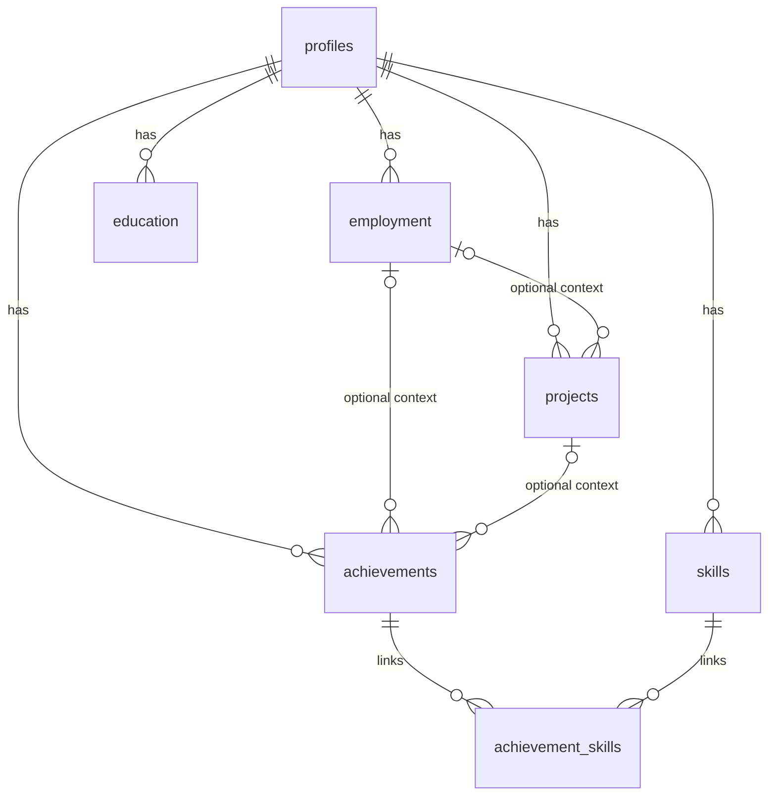

# 04 — PostgreSQL data model

Status: proposed logical model, no schema implemented. Updated 2026-09-13.

An Entity–Relationship (ER) diagram describes entities and their relationships. A logical relational ER model adds keys, attributes, and cardinality; a physical schema adds database-specific types, constraints, and indexes. The domain model explains what a Loan means; the ER model shows how `loans.copy_id` references `copies.id`.

PK means primary key: a row's stable identity. FK means foreign key: a database-enforced reference to another row. `1` means exactly one, `0..1` optional, and `0..N` any number. An employment record belongs to one profile; a profile may have many employment records.

Core evidence relationships (education and skills omitted for readability; the complete relationship table follows):

Crow's-foot notation: `||` exactly one, `|o` zero or one, `o{` zero or many. An achievement has at most one of employment or project as context.

## Phase 0 tables

Use stable UUID primary keys generated by the application as a simple proposed default; no additional UUID extension is necessary. All owned records include `profile_id`. Basic `created_at` and `updated_at` timestamps are metadata, not achievement history. Owner IDs prepare clear ownership but do not implement multi-user authorization.

| Table | Key fields / content |
|---|---|
| profiles | id; display name, headline, summary, contact details, location, preferences JSONB |
| employment | id, profile_id; employer name, role, dates, current flag, description |
| education | id, profile_id; institution, qualification, subject, dates, current/completion status |
| projects | id, profile_id, employment_id nullable; name, description, URL, dates |
| achievements | id, profile_id, employment_id nullable, project_id nullable; statement, optional problem/action/result/metric, source note/URL, reviewed flag |
| skills | id, profile_id; display name, normalized name, optional category |
| achievement_skills | profile_id, achievement_id, skill_id; composite PK on achievement_id + skill_id |

Preferences JSONB contains a small validated structure for desired roles, locations, work arrangement, and constraints; it is not a substitute for all relational data. Avoid an extensible entity-attribute-value system. Month-only dates are represented explicitly as year/month values, with paired-null checks and valid-month constraints; do not invent day precision. Final field names belong in the first migration review.

## Complete Phase 0 relationship table

| Parent | Child FK | Parent per child | Children per parent |
|---|---|---|---|
| profiles | employment.profile_id | 1 | 0..N |
| profiles | education.profile_id | 1 | 0..N |
| profiles | projects.profile_id | 1 | 0..N |
| profiles | achievements.profile_id | 1 | 0..N |
| profiles | skills.profile_id | 1 | 0..N |
| profiles | achievement_skills.profile_id | 1 | 0..N |
| employment | projects.employment_id | 0..1 | 0..N |
| employment | achievements.employment_id | 0..1 | 0..N |
| projects | achievements.project_id | 0..1 | 0..N |
| achievements | achievement_skills.achievement_id | 1 | 0..N |
| skills | achievement_skills.skill_id | 1 | 0..N |

## Constraints and changes

- No achievement revision table. Edits replace the current content; editing factual text clears its reviewed flag.
- An achievement has at most one of employment_id and project_id. Neither is required.
- Composite owner-aware foreign keys (profile_id, linked_id) reference matching unique parent keys, preventing cross-profile links. This is relational consistency, not an authorization substitute.
- Required display fields cannot be blank. Skills have unique normalized names within a profile. Trim text; do not silently equate semantically different skills.
- Save an achievement and its selected skill links in one transaction. Index commonly queried ownership/FK columns and avoid indexes already covered by suitable leading composite keys.
- Deleting employment/projects with dependent facts is restricted until the user explicitly detaches or reassigns them. Deleting an achievement removes only its skill joins, not the skills. Profile deletion is an explicit whole-profile operation.
- Historical generated input snapshots are not live cascading references to achievements. Deleting current data does not silently alter an old document; a full personal-data purge must also remove snapshots and PDFs.
- A backup/restore test must cover the database and, once introduced, the document artifact volume.

## Phase 1 storage sketch (not Phase 0 migrations)

| Record | Purpose |
|---|---|
| jobs | raw description, source, URL if provided, title/company, normalized attributes |
| applications | profile_id, job_id, status, notes, submission time; one pursuit per profile/job initially |
| generation_runs | state, selected input snapshot, template/prompt/model identifiers, timing/errors and usage when supplied |
| documents | application_id, type: resume / cover_letter / recruiter_message |
| document_revisions | document_id, structured content JSONB, optional generation_run_id, reviewed state; immutable saved revisions |
| document_artifacts | document_revision_id, format, template version, relative storage key, checksum, render status |

The database stores editable structured content and input snapshots. PDFs live in a persistent local artifact volume, with metadata in PostgreSQL. A renderer failure leaves saved text intact. Editing creates a new saved document revision, not a new achievement revision. Applications pin exact revisions used for submission. Provenance IDs inside document content refer to the run's frozen input snapshot, optionally carrying original record IDs for navigation.

PostgreSQL remains the source of truth. Later pgvector stores derived embeddings alongside it; a separate vector database is not required. Model choice, vector dimensions, retrieval strategy, and index tuning wait for a measured retrieval need.

Sources: [PostgreSQL constraints](https://www.postgresql.org/docs/current/ddl-constraints.html), [pgvector](https://github.com/pgvector/pgvector).
