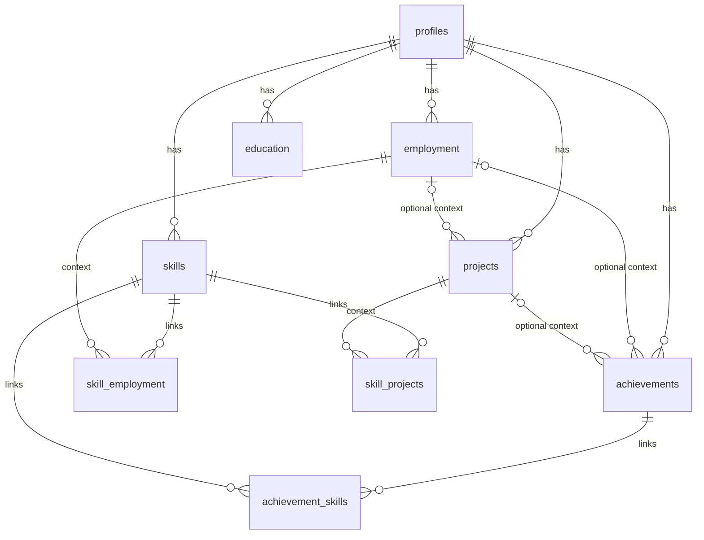
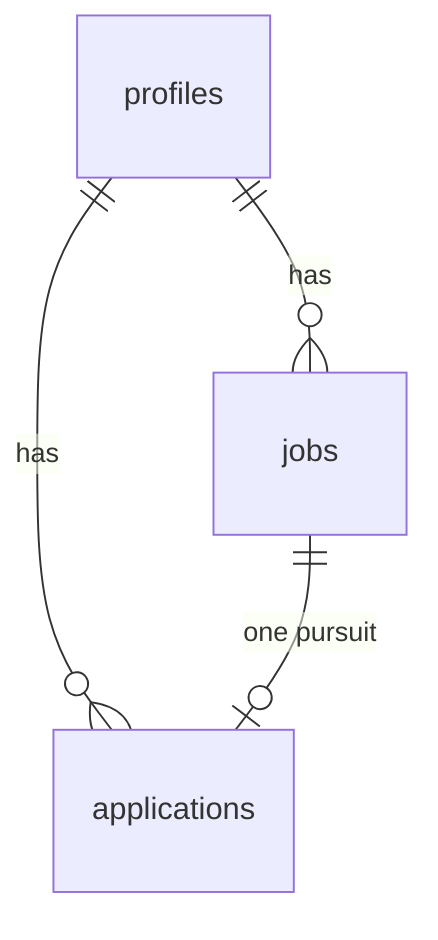
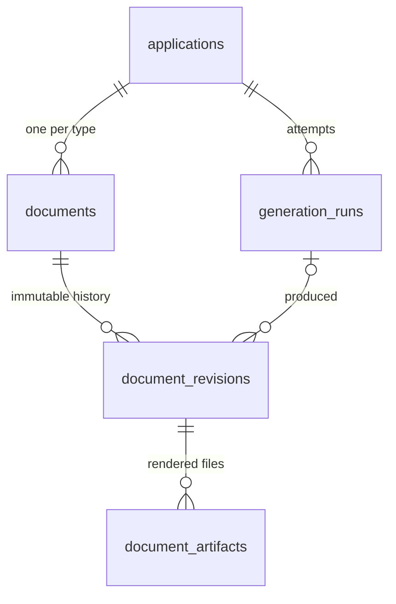

# 04 — PostgreSQL data model

Status: Phase 0 tables implemented in `db/migrations/0000_phase0_profile_tables.sql`; Phase 1a tables in `db/migrations/0001_phase1a_jobs_and_applications.sql`; Phase 1b tables in `db/migrations/0002_phase1b_documents_and_profile_links.sql`; the job salary column in `db/migrations/0003_phase1c_job_salary.sql`; the job logo columns in `db/migrations/0004_phase1c_job_logo.sql`; the employment location in `db/migrations/0005_phase1c_employment_location.sql`; the `assistant` run mode and revision source in `db/migrations/0006_phase1c_assistant_run_mode.sql`. Updated 2026-09-16.

An Entity–Relationship (ER) diagram describes entities and their relationships. A logical relational ER model adds keys, attributes, and cardinality; a physical schema adds database-specific types, constraints, and indexes. The domain model explains what a Loan means; the ER model shows how `loans.copy_id` references `copies.id`.

PK means primary key: a row's stable identity. FK means foreign key: a database-enforced reference to another row. `1` means exactly one, `0..1` optional, and `0..N` any number. An employment record belongs to one profile; a profile may have many employment records.

Core evidence relationships (education and skills omitted for readability; the complete relationship table follows):

Crow's-foot notation: `||` exactly one, `|o` zero or one, `o{` zero or many. An achievement has at most one of employment or project as context.

## Phase 0 tables

Primary keys are UUIDs minted by the application (the form generates the id before submitting, doc 05); no database UUID extension is used. All owned records include `profile_id`. Basic `created_at` and `updated_at` timestamps are metadata, not achievement history. Owner IDs prepare clear ownership but do not implement multi-user authorization.

| Table | Key fields / content |
|---|---|
| profiles | id; display_name (required), headline, summary, email, phone, location, preferences JSONB; links JSONB (Phase 1b: up to five `{label, url}` entries such as LinkedIn and GitHub, for the resume header) |
| employment | id, profile_id; employer_name, role (both required), location, start_year/start_month, end_year/end_month, is_current, description |
| education | id, profile_id; institution (required), qualification, subject, start/end year and month, status (`in_progress`, `completed`, `incomplete`), description |
| projects | id, profile_id, employment_id nullable; name (required), description, url, start/end year and month |
| achievements | id, profile_id, employment_id nullable, project_id nullable; statement (required), problem, action, result, metric, source_note, source_url, reviewed |
| skills | id, profile_id; display_name, normalized_name, category |
| achievement_skills | profile_id, achievement_id, skill_id; composite PK on achievement_id + skill_id |

Every table carries `created_at` and `updated_at`; `updated_at` doubles as the version token for stale-edit detection (doc 05).

Preferences JSONB contains a small validated structure (`desiredRoles`, `locations`, `workArrangement`, `constraints`); it is not a substitute for relational data. Avoid an extensible entity-attribute-value system. Month-only dates are year/month integer pairs with paired-null checks, a 1 to 12 month check, a 1900 to 2100 year check, and an end-not-before-start check; day precision is never invented.

## Complete Phase 0 relationship table

| Parent | Child FK | Parent per child | Children per parent |
|---|---|---|---|
| profiles | employment.profile_id | 1 | 0..N |
| profiles | education.profile_id | 1 | 0..N |
| profiles | projects.profile_id | 1 | 0..N |
| profiles | achievements.profile_id | 1 | 0..N |
| profiles | skills.profile_id | 1 | 0..N |
| profiles | achievement_skills.profile_id | 1 | 0..N |
| employment | projects.employment_id | 0..1 | 0..N |
| employment | achievements.employment_id | 0..1 | 0..N |
| projects | achievements.project_id | 0..1 | 0..N |
| achievements | achievement_skills.achievement_id | 1 | 0..N |
| skills | achievement_skills.skill_id | 1 | 0..N |

## Constraints and changes

- No achievement revision table. Edits replace the current content; editing factual text clears its reviewed flag.
- An achievement has at most one of employment_id and project_id. Neither is required.
- Composite owner-aware foreign keys (profile_id, linked_id) reference matching unique parent keys, preventing cross-profile links. This is relational consistency, not an authorization substitute.
- Required display fields cannot be blank. Skills have unique normalized names within a profile. Trim text; do not silently equate semantically different skills.
- Save an achievement and its selected skill links in one transaction. Index commonly queried ownership/FK columns and avoid indexes already covered by suitable leading composite keys.
- Deleting employment/projects with dependent facts is restricted (`ON DELETE RESTRICT`) until the user explicitly detaches or reassigns them; the UI explains which records block the deletion. Deleting an achievement or a skill removes only its join rows (`ON DELETE CASCADE` on `achievement_skills`). Deleting a profile cascades to everything it owns and is not exposed in the UI yet.
- Historical generated input snapshots are not live cascading references to achievements. Deleting current data does not silently alter an old document; a full personal-data purge must also remove snapshots and PDFs.
- Backup and restore use `pg_dump`/`pg_restore` through `pnpm db:backup` and `pnpm db:restore` (doc 07); the packaged shell launcher's backup also archives the artifact volume with the PDFs (doc 07).
- Owner-aware links require `UNIQUE (profile_id, id)` on each parent table; that index also serves per-profile lookups, so no separate `profile_id` index is added there.

## Profile mutation contract extension (ADR 009, pending merge)

The assistant adds no career tables or achievement history. Partial updates are merged with the stored record in the Profile module's transaction and validated with existing constraints. Creates use client ids for replay; first-profile creation is serialized. Assistant updates and deletes require the current `updated_at`. Skill deletion also advances affected achievements' versions when their join rows disappear. Whole-profile deletion remains unavailable through MCP. Frozen snapshots and saved document revisions are not rewritten by career-record changes.

## Phase 1a tables

Postings and pursuits, implemented 2026-09-14:

| Table | Key fields / content |
|---|---|
| jobs | id, profile_id; title, company_name (both required, not blank), location, salary (free text as the posting states it, never parsed), source (`pasted`), source_url, raw_description (required, not blank), availability (`active`, `expired`, `unknown`, default active), logo_storage_key and logo_content_type (`image/png`, `image/jpeg`, `image/webp`, `image/svg+xml`; both set or both null) |
| applications | id, profile_id, job_id; status (the eight values of document 05, default `preparing`), notes, submitted_at |

Rules the database backs up: `UNIQUE (profile_id, id)` on jobs so applications link owner-aware; `UNIQUE (profile_id, job_id)` on applications, one pursuit per profile and job; the composite foreign key `(profile_id, job_id)` references `jobs (profile_id, id)` with `ON DELETE CASCADE`, so deleting a job deletes its application (the interface confirms first); check constraints on source, availability, status and the logo pair; an index on jobs `(profile_id, updated_at)` for the list. A company logo is a file under the artifact directory at `<profile_id>/logos/<job_id>-<first 8 hex of its SHA-256>.<ext>`, written atomically (temporary name, then rename) before the row that references it, and served through `/jobs/<id>/logo?k=<hash>`; the hash in the address lets the browser cache it forever and makes a stale address answer 404. A replaced or removed logo, and the logo of a deleted job, has its file unlinked best effort after the commit; a file without a row is an orphan the row never points at, and a row without a file answers 404 until the logo is chosen again. `submitted_at` is set the first time the status becomes `applied` and kept on every later change; it is the user's own record of having sent the application, never something the app sets on its own. The derived status chip is never stored (document 05). Both tables carry `created_at` and `updated_at`, the latter as the stale-edit token.

| Parent | Child FK | Parent per child | Children per parent |
|---|---|---|---|
| profiles | jobs.profile_id | 1 | 0..N |
| profiles | applications.profile_id | 1 | 0..N |
| jobs | applications.(profile_id, job_id) | 1 | 0..1 |

## Phase 1b tables (implemented 2026-09-14, migration 0002)

| Table | Key fields / content |
|---|---|
| generation_runs | id, profile_id, application_id; document_type (`resume`, `cover_letter`, `recruiter_message`); state (`queued`, `running`, `succeeded`, `failed`, `cancelled`); failure_kind nullable (`provider`, `validation`, `pasted_invalid`, `interrupted`); mode (`adapter`, `pasted`, `assistant`: the user's own assistant through the `/mcp` endpoint, migration 0006); provider, model, prompt_name, prompt_version; snapshot JSONB (the frozen input: every career record with its id, the posting, the capture time); input_tokens, output_tokens, cost_usd (numeric, null when the provider reports none), latency_ms; error_message (a category or provider error class, never career content or the key); raw_output (kept only for validation failures, for inspection); started_at, finished_at |
| documents | id, profile_id, application_id, type; `UNIQUE (profile_id, application_id, type)` |
| document_revisions | id, profile_id, document_id, generation_run_id nullable; content JSONB (validated against the type's Zod schema); warnings JSONB (grounding results); source (`generated`, `pasted`, `assistant`, `edited`); reviewed_at nullable; created_at. Rows are never updated except to set reviewed_at |
| document_artifacts | id, profile_id, document_revision_id; format (`pdf`), template_version, storage_key (relative path under the artifact directory), checksum, byte_size; created_at. Inserted only after the file is fully written |

Rules the database backs up: `UNIQUE (profile_id, id)` on applications, added in the same migration so the new links can be owner-aware; owner-aware composite foreign keys from `generation_runs` and `documents` to `applications (profile_id, id)` with `ON DELETE CASCADE`, so deleting a job removes its application, documents, revisions, runs and artifact rows in one statement (files are reconciled separately); `document_revisions` and `document_artifacts` link owner-aware to their parents the same way; check constraints on every enumerated column; an index on `generation_runs (profile_id, application_id, created_at)` for the Runs column and the chip facts, and on `document_revisions (profile_id, document_id, created_at)` for the latest revision.

The database stores editable structured content and input snapshots. PDFs live in a persistent local artifact volume, with metadata in PostgreSQL. A renderer failure leaves saved text intact. Editing creates a new saved document revision, not a new achievement revision. Evidence ids inside document content are the ids of records in the run's snapshot, which are the original record ids, so a bullet can be traced to the live record while it exists and to the frozen copy forever. Pinning the exact revisions used for a submission on the application is deferred (document 09 gaps) until the submission flow needs it.

PostgreSQL remains the source of truth. Later pgvector stores derived embeddings alongside it; a separate vector database is not required. Model choice, vector dimensions, retrieval strategy, and index tuning wait for a measured retrieval need.

Sources: [PostgreSQL constraints](https://www.postgresql.org/docs/current/ddl-constraints.html), [pgvector](https://github.com/pgvector/pgvector).

## Direct skill contexts (migration 0007, local implementation pending acceptance)

`skill_employment` links a skill to multiple roles; `skill_projects` links it to multiple projects. Both carry `profile_id`, a composite primary key `(skill_id, context_id)`, owner-aware foreign keys and a reverse context lookup index. A skill owns these lists: row and links are saved together, and reads return their version and associations in one SQL statement. Skill deletion cascades to its joins; linked roles and projects require explicit detachment before deletion.

Achievement-derived skill connections and parent roles of linked projects are computed for browsing, never backfilled into direct link tables. Existing skills begin with empty direct lists; existing achievement links are preserved. Direct links currently support career browsing only: the document snapshot projection and grounding rules remain unchanged, so a context link alone does not become achievement evidence.

## Writing context (feature branch, pending local acceptance)

Migration 0008 adds nullable `profiles.about_me` and `applications.interest`. Each is edited in place with a version-checked partial update. About me accepts up to 12,000 characters and Interest 4,000; blank text clears the value. Updating General info or application status preserves these fields. Frozen generation snapshots remain independent of live edits.

## Companies, findings and Job Sources (local implementation, pending acceptance/merge)

| Table / field | Content and relationships |
|---|---|
| companies | Profile-owned id, required name, nullable location/website/about; shared logo_storage_key/logo_content_type pair; created_at and updated_at |
| company_findings | Profile and company ownership, text, source_url, retrieved_at date, kind (`statement`, `interpretation`), timestamps |
| jobs.company_id | Nullable owner-aware canonical company link; legacy rows receive distinct companies without name matching |
| job_finding_selections | Job/finding join with composite keys enforcing both owner and company agreement; at most five via the module contract |
| job_source_options | Profile-owned id, name, archived boolean, timestamps; no seeded rows |
| jobs.job_source_id | Nullable owner-aware source link, independent of source and source_url |

Company deletion is blocked while referenced by jobs. Changing a job's company clears its selections. Finding deletion cascades its live selections and invalidates affected job versions. Source options are archived/restored rather than deleted; existing assignments remain available. Schema changes use generated additive SQL migrations, never a data reset.

New cover-letter snapshots additionally freeze optional `writingContext`: About me and Interest with their citation IDs, all linked company fields, and the selected findings with their sources, dates and kinds. Old snapshots omit this optional object and remain valid. Career `evidenceIds` and optional paragraph `contextIds` are separate namespaces. Live edits and deletes cannot alter saved snapshots or revisions.

## Canonical company identity and shared logos (ADR 010 follow-up)

This supersedes the historical job-owned company-name/logo description above. Remove the separate jobs.company_name and job logo columns after migration; company records own the canonical name and logo metadata. Application composition resolves company identity for job lists/detail, MCP, new snapshots and PDF filenames. New jobs may have a null company_id.

Migration preserves existing linked Companies. For each legacy job without a company link it creates a distinct company using that job's stored company name, then links the job; it never groups records merely because their names match. A company whose logo is empty inherits the newest linked job's stored logo when available, while an existing company logo wins. Metadata can reference the existing artifact file: migration does not remove legacy files. Future company-logo changes use atomic file-first/row-second storage and safe replacement cleanup. Deleting one job leaves its company and shared logo intact. No historical snapshot or saved document revision is rewritten.
