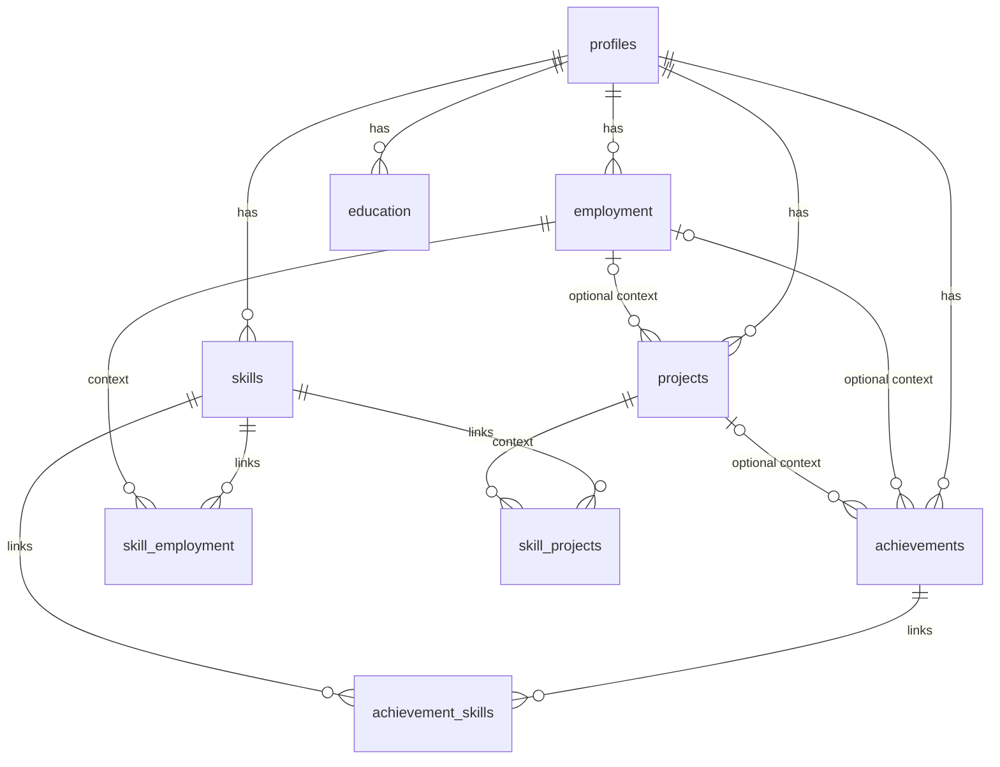
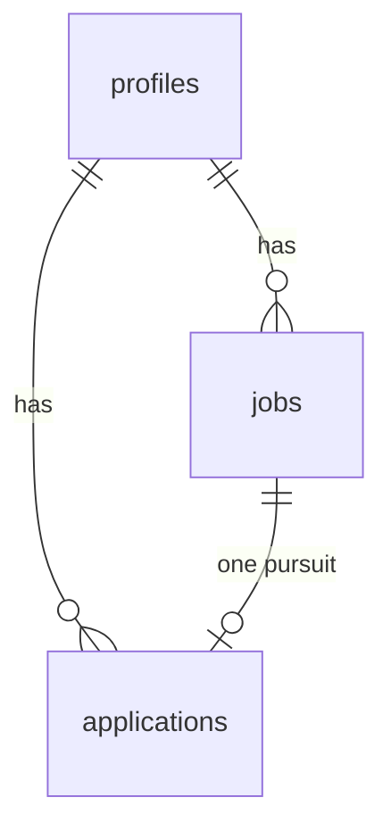
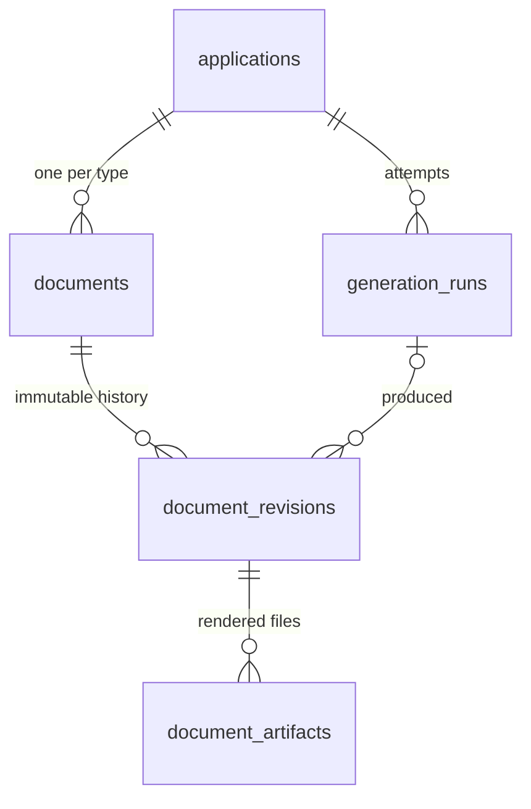

# 04 — Data model

Status: implemented in SQLite ([ADR 013](adr/013-desktop-distribution.md), 2026-10-02). Every table below is created by one baseline migration, `db/migrations/20261002212549_baseline/migration.sql`, which replaced the PostgreSQL migrations 0000–0011; the sections keep the phase in which each table was introduced. Updated 2026-10-02.

## Storage

Each installation is one SQLite file (`landed.db` in the app's data folder; `./data/landed.db` from a checkout), opened through Node's built-in `node:sqlite` with Drizzle's `node-sqlite` driver, in WAL mode with foreign keys on and a busy timeout. Types follow from SQLite:

- Ids are app-generated UUID text.
- Timestamps are integer milliseconds since the epoch, so compare-and-set on `updated_at` keeps full precision. Calendar dates without a time (such as `retrieved_at`) are `YYYY-MM-DD` text.
- JSON (preferences, links, snapshots, content, warnings) is text validated by Zod on the way in.
- Booleans are integers 0 and 1; `cost_usd` is a real.
- Enumerations are text with check constraints; owner-aware composite foreign keys work as before.

Migrations are generated by drizzle-kit as one folder per migration under `db/migrations/` (`<timestamp>_<name>/migration.sql` and `snapshot.json`; there is no journal file). Drizzle records applied migrations by name in `__drizzle_migrations`. `src/infrastructure/migrate.ts` applies them for the desktop app and `--mcp`; `db/migrate.mjs` (`pnpm db:migrate`) does the same for a contributor database. Migrations are forward-only and additive.

An Entity–Relationship (ER) diagram describes entities and their relationships. A logical relational ER model adds keys, attributes, and cardinality; a physical schema adds database-specific types, constraints, and indexes. The domain model explains what a Loan means; the ER model shows how `loans.copy_id` references `copies.id`.

PK means primary key: a row's stable identity. FK means foreign key: a database-enforced reference to another row. `1` means exactly one, `0..1` optional, and `0..N` any number. An employment record belongs to one profile; a profile may have many employment records.

Career evidence relationships (the relationship table below includes ownership keys):

```mermaid
erDiagram
  profiles ||--o{ employment : has
  profiles ||--o{ education : has
  profiles ||--o{ projects : has
  profiles ||--o{ achievements : has
  profiles ||--o{ skills : has
  employment |o--o{ projects : "optional context"
  employment |o--o{ achievements : "optional context"
  projects |o--o{ achievements : "optional context"
  achievements ||--o{ achievement_skills : links
  skills ||--o{ achievement_skills : links
  skills ||--o{ skill_employment : links
  employment ||--o{ skill_employment : context
  skills ||--o{ skill_projects : links
  projects ||--o{ skill_projects : context
```

Crow's-foot notation: `||` exactly one, `|o` zero or one, `o{` zero or many. An achievement has at most one of employment or project as context.

## Career fact tables

Primary keys are UUIDs minted by the application (the form generates the id before submitting, doc 05). All owned records include `profile_id`. Basic `created_at` and `updated_at` timestamps are metadata, not achievement history. Owner IDs prepare clear ownership but do not implement multi-user authorization.

| Table | Key fields / content |
|---|---|
| profiles | id; display_name (required), headline, summary, email, phone, location, preferences JSON; links JSON (Phase 1b: up to five `{label, url}` entries such as LinkedIn and GitHub, for the resume header) |
| employment | id, profile_id; employer_name, role (both required), location, start_year/start_month, end_year/end_month, is_current, description |
| education | id, profile_id; institution (required), qualification, subject, start/end year and month, status (`in_progress`, `completed`, `incomplete`), description |
| projects | id, profile_id, employment_id nullable; name (required), description, url, start/end year and month |
| achievements | id, profile_id, employment_id nullable, project_id nullable; statement (required), problem, action, result, metric, source_note, source_url, reviewed |
| skills | id, profile_id; display_name, normalized_name, category |
| achievement_skills | profile_id, achievement_id, skill_id; composite PK on achievement_id + skill_id |
| skill_employment | profile_id, skill_id, employment_id; composite PK on skill_id + employment_id |
| skill_projects | profile_id, skill_id, project_id; composite PK on skill_id + project_id |

Entity tables carry `created_at` and `updated_at`; link tables have composite keys without timestamps. For entity records, `updated_at` doubles as the version token for stale-edit detection (doc 05).

Preferences JSON contains a small validated structure (`desiredRoles`, `locations`, `workArrangement`, `constraints`); it is not a substitute for relational data. Avoid an extensible entity-attribute-value system. Month-only dates are year/month integer pairs with paired-null checks, a 1 to 12 month check, a 1900 to 2100 year check, and an end-not-before-start check; day precision is never invented.

## Career fact relationship table

| Parent | Child FK | Parent per child | Children per parent |
|---|---|---|---|
| profiles | employment.profile_id | 1 | 0..N |
| profiles | education.profile_id | 1 | 0..N |
| profiles | projects.profile_id | 1 | 0..N |
| profiles | achievements.profile_id | 1 | 0..N |
| profiles | skills.profile_id | 1 | 0..N |
| profiles | achievement_skills.profile_id | 1 | 0..N |
| employment | projects.employment_id | 0..1 | 0..N |
| employment | achievements.employment_id | 0..1 | 0..N |
| projects | achievements.project_id | 0..1 | 0..N |
| achievements | achievement_skills.achievement_id | 1 | 0..N |
| skills | achievement_skills.skill_id | 1 | 0..N |
| profiles | skill_employment.profile_id | 1 | 0..N |
| profiles | skill_projects.profile_id | 1 | 0..N |
| skills | skill_employment.skill_id | 1 | 0..N |
| employment | skill_employment.employment_id | 1 | 0..N |
| skills | skill_projects.skill_id | 1 | 0..N |
| projects | skill_projects.project_id | 1 | 0..N |

## Constraints and changes

- No achievement revision table. Edits replace the current content; editing factual text clears its reviewed flag.
- An achievement has at most one of employment_id and project_id. Neither is required.
- Composite owner-aware foreign keys (profile_id, linked_id) reference matching unique parent keys, preventing cross-profile links. This is relational consistency, not an authorization substitute.
- Required display fields cannot be blank. Skills have unique normalized names within a profile. Trim text; do not silently equate semantically different skills.
- Save an achievement and its selected skill links in one transaction. Index commonly queried ownership/FK columns and avoid indexes already covered by suitable leading composite keys.
- Deleting employment/projects with dependent facts is restricted (`ON DELETE RESTRICT`) until the user explicitly detaches or reassigns them; the UI explains which records block the deletion. Deleting an achievement or a skill removes only its join rows (`ON DELETE CASCADE` on `achievement_skills`). Deleting a profile cascades to everything it owns and is not exposed in the UI yet.
- Historical generated input snapshots are not live cascading references to achievements. Deleting current data does not silently alter an old document; a full personal-data purge must also remove snapshots and PDFs.
- The desktop app copies the file with `VACUUM INTO` to its `backups/` folder before applying pending migrations and keeps the last five. From a checkout, `pnpm db:backup` and `pnpm db:restore` copy and restore the file (doc 07). PDFs and logos are files beside it and are not in the database copy.
- Owner-aware links require `UNIQUE (profile_id, id)` on each parent table; that index also serves per-profile lookups, so no separate `profile_id` index is added there.

## Profile mutation contract extension (ADR 009, merged)

The assistant adds no career tables or achievement history. Partial updates are merged with the stored record in the Profile module's transaction and validated with existing constraints. Creates use client ids for replay; first-profile creation is serialized. Assistant updates and deletes require the current `updated_at`. Skill deletion also advances affected achievements' versions when their join rows disappear. Whole-profile deletion remains unavailable through MCP. Frozen snapshots and saved document revisions are not rewritten by career-record changes.

## Phase 1a tables

Postings and pursuits, implemented 2026-09-14:

```mermaid
erDiagram
  profiles ||--o{ jobs : has
  profiles ||--o{ applications : has
  jobs ||--o| applications : "one pursuit"
```

| Table | Key fields / content |
|---|---|
| jobs | id, profile_id; title (required, not blank), optional canonical company_id and job_source_id, location, salary (free text as the posting states it, never parsed), source (`pasted`), source_url, raw_description (required, not blank), availability (`active`, `expired`, `unknown`, default active). The ADR 011 follow-up removes the former company_name and job logo columns. |
| applications | id, profile_id, job_id; status (the eight values of document 05, default `preparing`), notes, submitted_at |

Rules the database backs up: `UNIQUE (profile_id, id)` on jobs so applications link owner-aware; `UNIQUE (profile_id, job_id)` on applications, one pursuit per profile and job; the composite foreign key `(profile_id, job_id)` references `jobs (profile_id, id)` with `ON DELETE CASCADE`, so deleting a job deletes its application (the interface confirms first); check constraints on source, availability and status; an index on jobs `(profile_id, updated_at)` for the list. Company logos belong to Companies, with both metadata fields set or both null and an allowed image content type. New files use `<profile_id>/logos/<company_id>-<randomUUID>-<first 8 hex of SHA-256>.<ext>`, written atomically before the company row references them. Each write gets a distinct path so concurrent replacement/removal cannot unlink a newly restored copy of the same bytes. Logos are served through `/companies/<id>/logo?k=<version>`; stale addresses answer 404. Legacy stored filenames remain readable without renaming. Replacing, clearing or deleting a company's logo unlinks its prior file best effort after commit; deleting a job does not remove shared company files. A missing file answers 404 until the logo is chosen again. Migration itself never unlinks legacy artifacts. `submitted_at` is set the first time the status becomes `applied` and kept on every later change; it is the user's own record of having sent the application, never something the app sets on its own. The derived status chip is never stored (document 05). Both tables carry `created_at` and `updated_at`, the latter as the stale-edit token.

| Parent | Child FK | Parent per child | Children per parent |
|---|---|---|---|
| profiles | jobs.profile_id | 1 | 0..N |
| profiles | applications.profile_id | 1 | 0..N |
| jobs | applications.(profile_id, job_id) | 1 | 0..1 |

## Phase 1b tables (implemented 2026-09-14)

```mermaid
erDiagram
  applications ||--o{ documents : "one per type"
  applications ||--o{ generation_runs : "attempts"
  documents ||--o{ document_revisions : "immutable history"
  generation_runs |o--o{ document_revisions : "produced"
  document_revisions ||--o{ document_artifacts : "rendered files"
```

| Table | Key fields / content |
|---|---|
| generation_runs | id, profile_id, application_id; document_type (`resume`, `cover_letter`, `recruiter_message`); state (`queued`, `running`, `succeeded`, `failed`, `cancelled`); failure_kind nullable (`provider`, `validation`, `pasted_invalid`, `interrupted`); mode (`adapter`, `pasted`, `assistant`: the user's own assistant over MCP); provider, model, prompt_name, prompt_version; snapshot JSON (the frozen input: every career record with its id, the posting, the capture time); input_tokens, output_tokens, cost_usd (real, null when the provider reports none), latency_ms; error_message (a category or provider error class, never career content or the key); raw_output (kept only for validation failures, for inspection); started_at, finished_at |
| documents | id, profile_id, application_id, type; `UNIQUE (profile_id, application_id, type)` |
| document_revisions | id, profile_id, document_id, generation_run_id nullable (a foreign key on the run id alone, `ON DELETE SET NULL`); content JSON (validated against the type's Zod schema); warnings JSON (grounding results); source (`generated`, `pasted`, `assistant`, `edited`); reviewed_at nullable; created_at. Rows are never updated except to set reviewed_at |
| document_artifacts | id, profile_id, document_revision_id; format (`pdf`), template_version, storage_key (relative path under the artifact directory), checksum, byte_size; created_at. Inserted only after the file is fully written |

Rules the database backs up: `UNIQUE (profile_id, id)` on applications so the new links can be owner-aware; owner-aware composite foreign keys from `generation_runs` and `documents` to `applications (profile_id, id)` with `ON DELETE CASCADE`, so deleting a job removes its application, documents, revisions, runs and artifact rows in one statement (files are reconciled separately); `document_revisions` and `document_artifacts` link owner-aware to their parents the same way, except the revision's run link, which references `generation_runs (id)` alone because `SET NULL` on a composite key would also null `profile_id`; check constraints on every enumerated column; an index on `generation_runs (profile_id, application_id, created_at)` for the Runs column and the chip facts, and on `document_revisions (profile_id, document_id, created_at)` for the latest revision.

The database stores editable structured content and input snapshots. PDFs live as files in the artifact folder, with metadata in the database. A renderer failure leaves saved text intact. Editing creates a new saved document revision, not a new achievement revision. Evidence ids inside document content are the ids of records in the run's snapshot, which are the original record ids, so a bullet can be traced to the live record while it exists and to the frozen copy forever. Pinning the exact revisions used for a submission on the application is deferred (document 09 gaps) until the submission flow needs it.

The database file remains the source of truth. Embeddings, if added later, are derived indexes beside it; model choice, vector dimensions, retrieval strategy and storage wait for a measured retrieval need.

Sources: [SQLite](https://sqlite.org/lang_createtable.html), [Drizzle SQLite](https://orm.drizzle.team/docs/get-started-sqlite).

## Direct skill contexts (merged)

`skill_employment` links a skill to multiple roles; `skill_projects` links it to multiple projects. Both carry `profile_id`, a composite primary key `(skill_id, context_id)`, owner-aware foreign keys and a reverse context lookup index. A skill owns these lists: row and links are saved together, and reads return their version and associations in one SQL statement. Skill deletion cascades to its joins; linked roles and projects require explicit detachment before deletion.

Achievement-derived skill connections and parent roles of linked projects are computed for browsing, never backfilled into direct link tables. Existing skills begin with empty direct lists; existing achievement links are preserved. Direct links currently support career browsing only: the document snapshot projection and grounding rules remain unchanged, so a context link alone does not become achievement evidence.

## Writing context (implemented and merged)

Nullable `profiles.about_me` and `applications.interest` hold the writing context. Each is edited in place with a version-checked partial update. About me accepts up to 12,000 characters and Interest 4,000; blank text clears the value. Updating General info or application status preserves these fields. Frozen generation snapshots remain independent of live edits.

## Companies, findings and Job Sources (implemented and merged)

| Table / field | Content and relationships |
|---|---|
| companies | Profile-owned id, required name, nullable location/website/about; shared logo_storage_key/logo_content_type pair; created_at and updated_at |
| company_findings | Profile and company ownership, text, source_url, retrieved_at date, kind (`statement`, `interpretation`), timestamps |
| jobs.company_id | Nullable owner-aware canonical company link; legacy rows receive distinct companies without name matching |
| job_finding_selections | Job/finding join with composite keys enforcing both owner and company agreement; at most five via the module contract |
| job_source_options | Profile-owned id, name, archived boolean, timestamps; no seeded rows |
| jobs.job_source_id | Nullable owner-aware source link, independent of source and source_url |

Company deletion is blocked while referenced by jobs. Changing a job's company clears its selections. Finding deletion cascades its live selections and invalidates affected job versions. Source options are archived/restored rather than deleted; existing assignments remain available. Schema changes use generated additive SQL migrations, never a data reset.

New cover-letter snapshots additionally freeze optional `writingContext`: About me and Interest with their citation IDs, all linked company fields, and the selected findings with their sources, dates and kinds. Old snapshots omit this optional object and remain valid. Career `evidenceIds` and optional paragraph `contextIds` are separate namespaces. Live edits and deletes cannot alter saved snapshots or revisions.

## Canonical company identity and shared logos (ADR 011 follow-up)

This supersedes the historical job-owned company-name/logo description above. The separate jobs.company_name and job logo columns were removed; company records own the canonical name and logo metadata. Application composition resolves company identity for job lists/detail, MCP, new snapshots and PDF filenames. New jobs may have a null company_id.

The PostgreSQL-era migration preserved existing linked Companies; the SQLite baseline carries the result. For each legacy job without a company link it created a distinct company using that job's stored company name, then linked the job; it never grouped records merely because their names match. A company whose logo is empty inherits the newest linked job's stored logo when available, while an existing company logo wins. Metadata can reference the existing artifact file: migration does not remove legacy files. Future company-logo changes use atomic file-first/row-second storage and safe replacement cleanup. Deleting one job leaves its company and shared logo intact. No historical snapshot or saved document revision is rewritten.

## Document field editing and letterhead (implemented and merged)

Expanded inline editing continues to store the same validated content JSON in immutable revisions. Empty optional fields normalize to null; required text stays nonempty. No table or migration change is needed. Cover-letter content adds an optional nullable `title` (maximum 120 characters). Omission projects the frozen profile headline; explicit null hides it. Old JSON remains valid and historical revisions are not rewritten. Metadata edits retain the generation run, evidence and context IDs, and clear approval on the new revision only. Letterhead identity, contact, recipient and date are projected from the revision's frozen snapshot. The merged letter layout introduced PDF template version 8; ADR 012 advances it to 9. A template-version change regenerates cached output on demand without modifying saved text or older artifacts.

## Document formatting and resume contacts (2026-09-26, implemented, merged in PRs #54–56)

ADR 012 adds optional formatting entries to resume/cover-letter content JSON and contactSelection to resume content. Each formatting entry contains a permitted editable path and text segments with supported marks; concatenated text must equal the field text. Profile preferences JSON adds optional resumeContacts; snapshots freeze resumeContacts. Existing rows are not rewritten and no SQL migration is needed. Revision writers are serialized by `runInTransaction`. An edit checks its expected revision inside that transaction; insertion uses a timestamp later than the previous revision so ordering remains deterministic even when the clock has not advanced. Generation uses the same insertion boundary.
