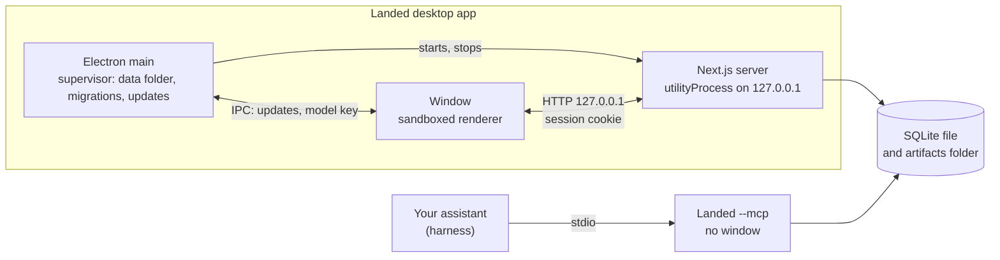

# ADR 013 — Desktop distribution with SQLite and stdio MCP

Date: 2026-10-02. Status: accepted, not implemented. Supersedes [ADR 003](003-local-packaging.md); revises [ADR 001](001-local-typescript-postgresql.md), [ADR 004](004-drizzle-persistence.md), [ADR 006](006-model-access-path.md) and [ADR 008](008-assistant-surface-over-mcp.md).

## Context

ADR 003 shipped a Docker Compose release and named its own limit: Docker is a substantial prerequisite that needs troubleshooting, and a desktop distribution becomes worthwhile if installation remains the main barrier. It does. Installing Docker, opening a terminal and running a launcher is not a double-click install, and the people a job-search tool should serve are not all comfortable with any of those steps.

ADR 001 chose PostgreSQL partly because Compose made a database server free to ship. In a desktop application that reverses: a database server is a process to start, stop, upgrade and recover on every user's computer, on three operating systems, with nobody to administer it.

The assistant workflow has a second constraint. Under ADR 008 the user's harness reaches Landed's tools through `/mcp` on the running server, so the tools disappear whenever the installation is stopped. A harness should be able to use them while the app is closed.

## Decision

**Electron shell.** Landed ships as an Electron desktop app. The main process is a thin supervisor: it owns the data directory, runs migrations with a backup first, starts and stops the server, opens the window and handles updates. The existing Next.js standalone server runs unchanged in an Electron `utilityProcess`, bound to 127.0.0.1 on a free port, and the window loads it over HTTP.

**HTTP, not IPC.** The interface is Server Components and Server Actions. Moving it onto IPC would require a static export and rewriting every route's data loading. MCP clients, and any future hosted mode, speak HTTP or stdio anyway, so IPC would add a second transport rather than replace one. IPC is reserved for native needs, currently update status and restart and entering the model key into the OS keychain ([ADR 006](006-model-access-path.md#revision-2026-10-02-adr-013)), each on an allowlisted channel whose sender origin main checks.

The renderer runs with `contextIsolation` and `sandbox` on, `nodeIntegration` off and a minimal preload. External links open in the system browser; navigation is restricted to the local origin; permission requests are denied. The Electron fuses for `RunAsNode`, `NODE_OPTIONS` and the inspector are off. Main sets a per-launch session secret as an `HttpOnly`, `SameSite=Strict` cookie on the window's session, and the server refuses requests without it, so only the Landed window can drive the server. The existing Host and Origin guard stays.

**SQLite replaces PostgreSQL.** Each installation is one database file in the app's data folder, opened in WAL mode with foreign keys on and a busy timeout. Access goes through Node's built-in `node:sqlite` with Drizzle's `node-sqlite` driver on the Drizzle 1.0 line; if the built-in module proves unsuitable, the fallback is `better-sqlite3` on the stable Drizzle line.

Concurrency: one writer connection, on which every write happens inside a transaction serialized by an in-process async mutex and opened with `BEGIN IMMEDIATE`; nested calls become savepoints, as they do now. A separate read-only connection serves reads outside transactions. This replaces the PostgreSQL advisory locks and `FOR UPDATE` row locks; version tokens and stale checks are unchanged. Across processes (the stdio command below), SQLite's file lock and busy timeout serialize writers. Timestamps are stored as integer milliseconds so compare-and-set keeps its precision; JSON is stored as text; ids remain app-generated UUID text.

**MCP over stdio.** The harness launches the installed app with `--mcp`. That mode opens no window, opens the same database file and artifact folder, and registers the same tools with the same validation, grounding check and run records. No token is needed because stdio is private to the process that launched it. The HTTP `/mcp` endpoint and `LANDED_MCP_TOKEN` are removed. `render_pdf` returns a file path instead of a download address. A background daemon was rejected (see Alternatives).

**No Docker.** The Compose file, the Dockerfile and the launchers are removed. Contributors run `pnpm dev` or `pnpm start` against a local SQLite file and need no Docker.

**Updates and migrations.** Installers are built from tags and published on GitHub Releases. The app checks for updates and installs one only on restart, never mid-session. Before applying pending migrations, main copies the database with `VACUUM INTO` to a backups folder and keeps the last few copies; migrations then run in one transaction before the server starts. A database carrying migrations unknown to the running build is refused, with an offer to restore a backup. Migrations are forward-only and additive, and a stdio process from an older version refuses to operate on a newer schema.

macOS builds are unsigned at first. Squirrel.Mac installs updates only for a signed app, so macOS has no automatic install and the app links to the release page instead; Windows (NSIS) and Linux (AppImage) update automatically. Existing Compose installations move their data with a one-time import script that reads PostgreSQL and writes the SQLite file.

## Alternatives considered

Keep Compose. It works and is tested on macOS, but it keeps Docker as the prerequisite this decision exists to remove, and it keeps the tools tied to a running server.

Electron with embedded PostgreSQL binaries. Full fidelity with the current schema and queries, but the app would own a server process per installation, and the stdio command could not share it safely while the app is closed without starting a server of its own.

PGlite. PostgreSQL compiled to WebAssembly, with a single connection inside one process. It has the same sharing problem: the window's server and the stdio command could not open the database at the same time.

IPC as the interface transport. Rejected above: a static export, every route's data loading rewritten, and a second transport beside the HTTP and stdio that clients use anyway.

A background daemon serving MCP while the window is closed. It adds an installer step, a service to update and the version skew between daemon and app, for what a process launched on demand already gives.

Tauri. Smaller installers, but it brings a Rust toolchain and system webview differences across platforms, and the server Landed already has is Node, which Electron runs as is.

## Consequences and reconsideration

- Supersedes ADR 003. Revises the database choice of ADR 001 and the PostgreSQL specifics of ADR 004: Drizzle stays, and migrations restart from a SQLite baseline. Revises the transport of ADR 008; its tools, validation and run records are unchanged. Revises ADR 006 for where model configuration is entered (see its revision).
- Costs: an installer of roughly 100 MB to download, about 300 MB of memory at runtime, code signing still to add, a dependency on the Drizzle 1.0 beta line, and Node 24 as the runtime for `node:sqlite`.
- Phone or claude.ai access to a local installation still needs its own design; it no longer has an HTTP MCP endpoint to reuse.
- Reconsider if a hosted mode is ever built (PostgreSQL, or one SQLite file per user, then), or if `node:sqlite` or the Drizzle beta prove unstable.
